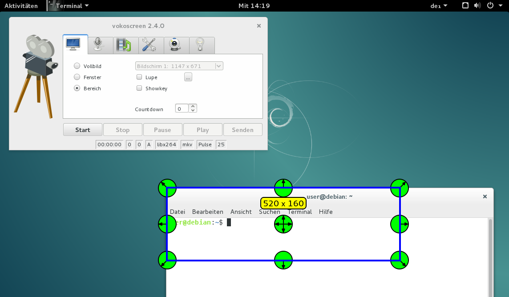
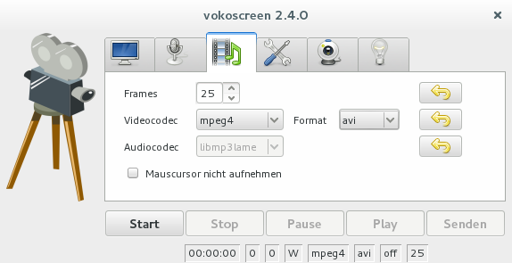

# Bildschirmvideo

Mit dem Programm **Vokoscreen** können Teile des Bildschirms, einzelne Fenster oder der gesamte Desktop gefilmt werden.

Der Videocodec sowie das Format kann im entsprechenden Register den eigenen Wünschen angepasst werden:

Tipp: In GNOME  funktioniert die Anzeige von Vokoscreen als Symbol bei der Aufnahme in der GNOME-Shell nicht. Daher sollte das Tool nicht den Aufnahmebereich überschneiden, um auf “Start” bzw. “Stop” klicken zu können.

