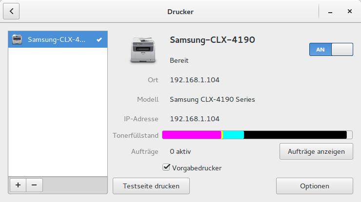
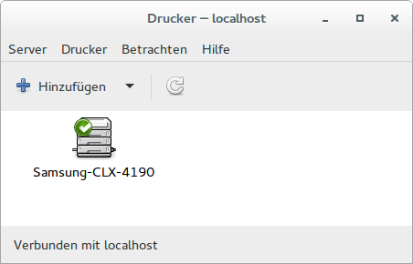

# Einrichten eines Druckers

Wählen Sie in den Systemeinstellungen das Druckersymbol und klicken Sie auf das “+”-Symbol links unten.
Die weiteren Schritte sind einigermaßen selbsterklärend.

<span style="color:red">Tipp:</span> Ein alternatives Programm zur Druckerkonfiguration können Sie über “Aktivitäten -> Anwendungen anzeigen -> Einstellungen -> Druckeinstellungen” starten. Dieses bietet in einigen Bereichen mehr Möglichkeiten als die GNOME-Systemsteuerung, ist dadurch aber auch komplexer in der Handhabung.






Der Hersteller Hewlett Packard hat für seine Drucker ein ganz eigenes Einrichtungs- und Verwaltungsprogramm geschrieben.
Wenn Sie also einen Drucker von HP einrichten oder verwalten möchten, wählen Sie bitte “Aktivitäten -> Anwendungen anzeigen -> Einstellungen -> HP Setup" und folgen den Anweisungen des Programms, um Ihren HP-Drucker einzurichten.

Man kann die Drucker auch über **CUPS** [http://localhost:631](http://localhost:631) einrichten und verwalten.

Dazu muss ein root-Passwort angelegt werden (z.B. live oder 0000) mit:

```bash
user@debian:~$ sudo -s
root@debian:/home/user# passwd root
```
