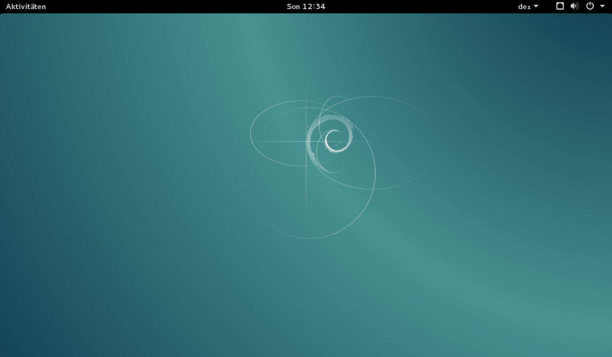
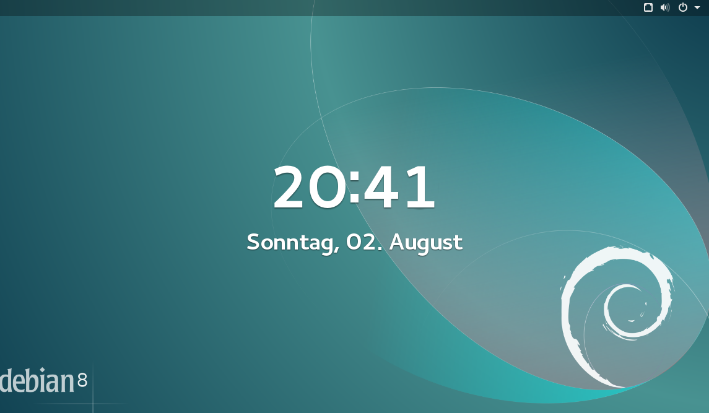
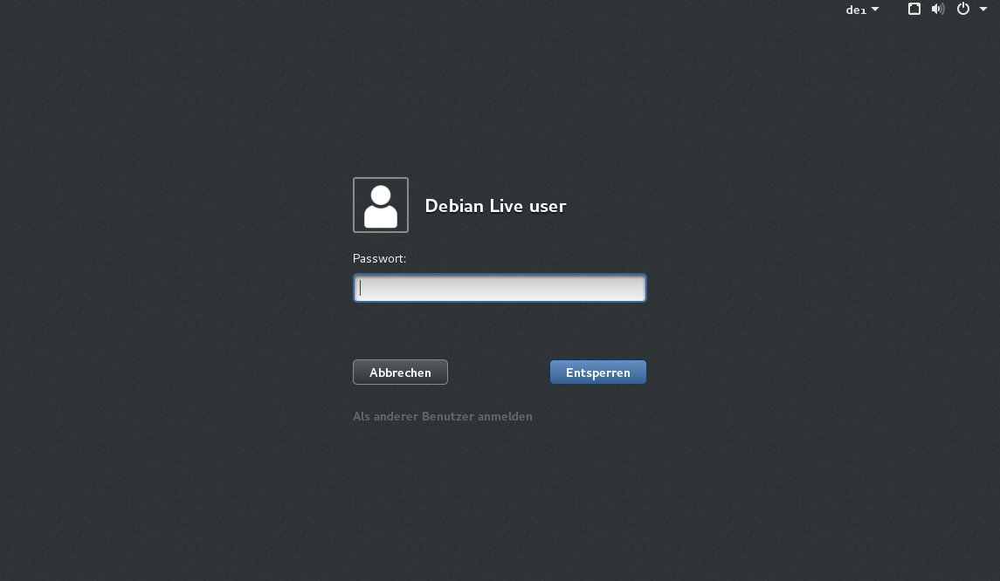
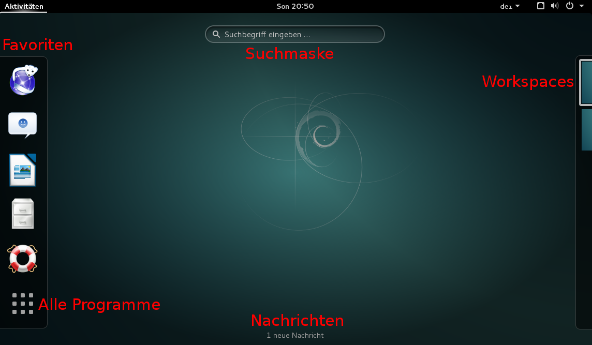
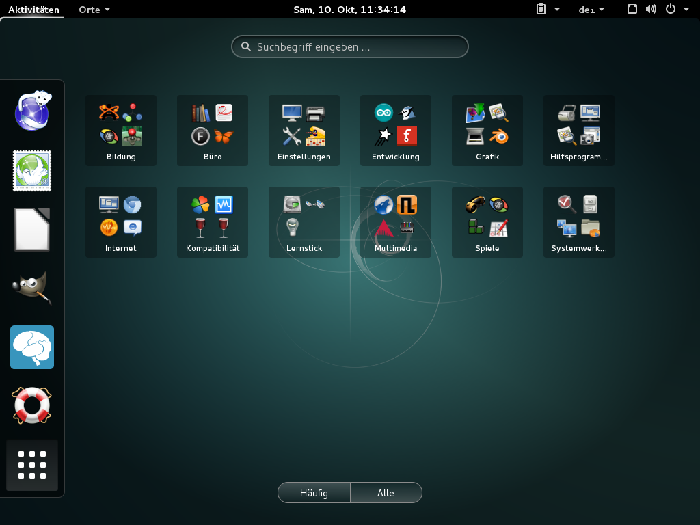
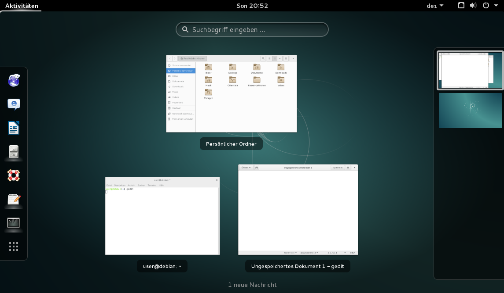
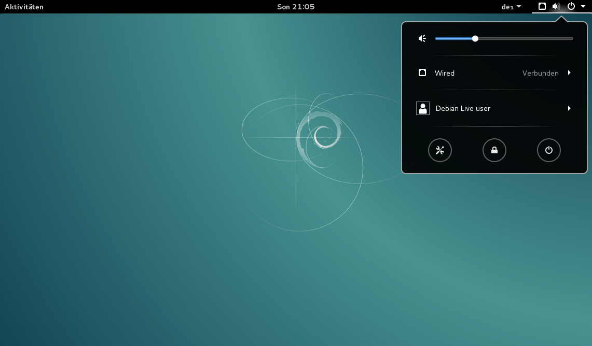
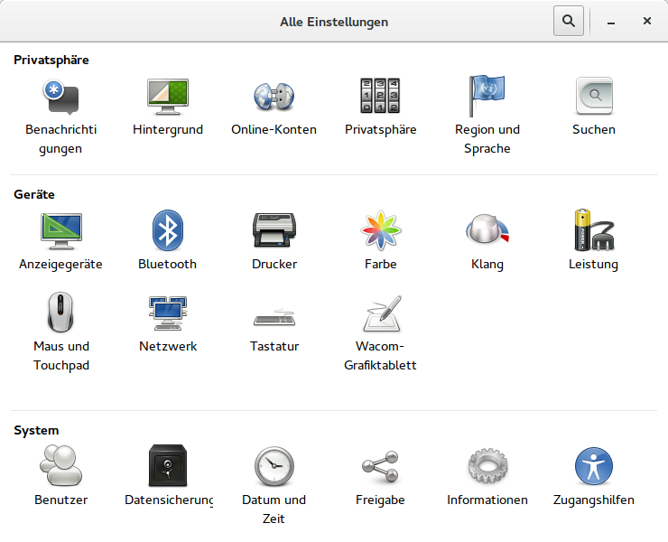
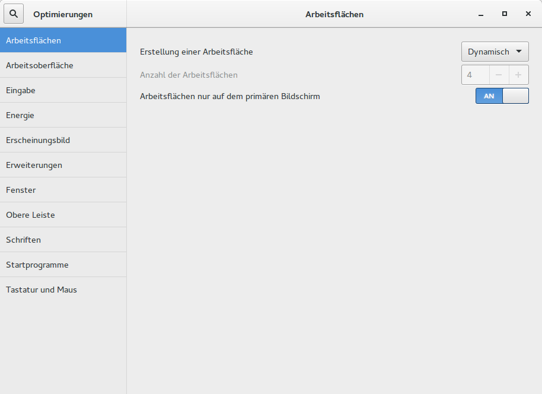

# GNOME-Desktop

Der GNOME-Desktop in der Version 3.14.1 ist die standardmäßig eingestellte Oberfläche im Lernstick 8. 
Neben der guten Unterstützung hochauflösender Displays ermöglicht dieser rasches Arbeiten und legt einen Fokus auf Übersichtlichkeit. 
Kritiker führen an, dass effizientes Arbeiten jedoch nur mit Tastatur UND Maus möglich ist und etliche Einstellungsmöglichkeiten nur schwierig zu finden sind.

Tipp: Der Lernstick bietet neben GNOME auch die meisten anderen geläufigen Desktops an, sodass im Endeffekt jeder Benutzer selbst die Wahl hat, welche Oberfläche er verwenden möchte. 

So kann etwa neben dem Windows-7-ähnlichen KDE auch ein besonders ressourcenschonender Desktop wie XFCE, LXDE oder MATE für ältere Geräte genutzt werden.

## Bildschirmsperre

Nach einer gewissen Zeit an Inaktivität wechselt der Desktop zum Sperrbildschirm. Durch Drücken der Enter- oder Leertaste sowie durch Hinaufziehen mit der Maus gelangt man zur Login-Maske. Da das Passwort des Lernsticks leer ist, braucht man nur auf “Entsperren” klicken, um wieder zum Desktop zurückzukehren.

Tipp: In den Einstellungen kann die Pflicht der Passworteingabe deaktiviert werden. Der Sperrbildschirm selbst kann jedoch nicht deaktiviert werden.

## Die GNOME-Shell

Die schwarze Leiste am oberen Bildschirmrand wird Gnome-Shell genannt. Sie unterteilt sich im wesentlichen in 4 Bereiche:
Aktivitäten

* Eintrag/Menü des aktiven Programms
* Datum und Uhrzeit
* Einstellungen sowie Shutdown-Menü

Unter Aktivitäten bieten sich wiederum folgende Möglichkeiten:

Tipp: Die Aktivitäten kann man durch linken Mausklick, durch Bewegen der Maus in die linke obere Ecke oder durch Drücken der Windows Taste öffnen.

Folgende Grafik zeigt die Übersicht der verfügbaren **Programme**:

Interessant ist vor allem die **Übersicht der gerade geöffneten Programme**. Hier finden sich auch minimierte Anwendungen wieder. 
Die Funktion gleicht der Exposé Funktion von Mac OS. 
Am rechten Rand sieht man zurzeit **2 verfügbare Workspaces**. Sobald eine Anwendung auf Workspace 2 geschoben wird, erscheint ein leerer Workspace 3.

Wichtig ist auch der Bereich ganz rechts oben in der GNOME-Shell. Hier findet man u.a. auch die Systemeinstellungen (Werkzeug-Symbol).

Neben den allgemeinen **Einstellungen** gibt es noch das Werkzeug **“Optimierungen”** für Feineinstellungen. 

Dieses findet sich bei den Anwendungen unter Aktivitäten.

Tipp: Für Details zum GNOME-Deskop sind die beiden Seiten [https://help.gnome.org/users/gnome-help/stable/index.html.de](https://help.gnome.org/users/gnome-help/stable/index.html.de) sowie [http://wiki.ubuntuusers.de/gnome_shell](http://wiki.ubuntuusers.de/gnome_shell) für den Einstieg ganz hilfreich.

Ergänzt wird das Erscheinungsbild von GNOME durch [‘gnome-shell-extensions’](https://extensions.gnome.org). Diese **extensions** können wahlweise installiert und ON/OFF gesetzt werden.
Hier eine Auswahl zum Ausprobieren:
Applications Menu, Favorites Menu, TopIcons Plus, Workspace to Dock, Removable Drive Menu, Frippery Move Clock, Places Status Indicator, Trash, Workspace Indicator

