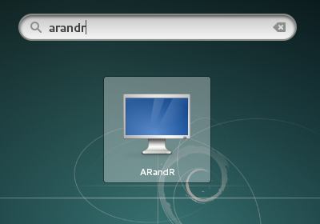
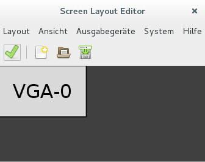

# Arbeiten mit einem Projektor/Beamer

Die Details, wie mit einem Projektor gearbeitet werden kann, hängen stark von der im gerade benutzten Computer eingebauten Grafikkarte ab. 
Bei vielen Computern reicht es aus, den Projektor schon vor dem Bootvorgang am Computer anzuschließen. 
Häufig wird man sich jedoch auch in der Situation befinden, ein laufendes Notebook im Nachhinein an einen Projektor anschließen zu wollen. 
Aus der praktischen Erfahrung hat sich gezeigt, dass mit dem Tool **ARandR** (Aktivitäten -> Anwendungen anzeigen -> Einstellungen -> ARandR) unter allen grafischen Oberflächen eine gute Steuerung der verschiedenen Displays zu erzielen ist.

Unter Ausgabegeräte finden sich alle verfügbaren Displays (PC, Laptop, Beamer, Tablet, …). Eine Spiegelung ist aber nur dann sinnvoll möglich, wenn die Ausgabegeräte auch die selbe Auflösung unterstützen.

**Tipp:** Achten Sie schon bei der Hardware-Anschaffung darauf, dass etwa Beamer und Laptop die selbe Auflösung verstehen. Die Empfehlung lautet derzeit Full-HD, da andere Auflösungen wie 1366x768 bzw. 1280x800 manchmal Probleme bereiten können.

Etwas anders schaut es bei speziellen Grafikkarten etwa von NVIDIA aus. Hier gilt es am besten vor Ort zu testen ob die Geräte ohne große Zeitanstrengung zueinander kompatibel sind. Die Ergebnisse können hier besser sein als bei OnBoard-Grafikkarten.
