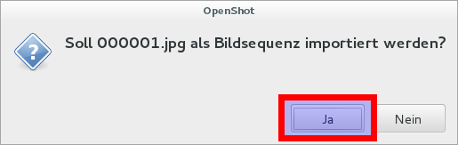

# Stop-Motion-Filme
 
Um mit dem Lernstick ansprechende Stop-Motion-Filme zu erstellen, ist ein Zusammenspiel mehrerer Programme notwendig. Die Einzelbilder werden am einfachsten mit dem Programm “Stopmotion” erstellt. Das Programm bietet unter anderem die Möglichkeit, eine bestimmte Anzahl vorheriger Bilder mit dem aktuellen Kamerabild zu vermischen, was bei der Ausrichtung der Elemente für das nächste Bild sehr hilfreich ist. Hier ein Beispiel mit einem Kugelschreiber, der über den Tisch bewegt wird:

Wenn alle Einzelbilder erstellt worden sind, kann das Projekt gespeichert werden:

Stopmotion speichert Projektdateien mit der Endung “.sto” ab. Diese Dateien sind allerdings nichts weiter als umbenannte [TAR-Dateien](https://de.wikipedia.org/wiki/Tar_(Packprogramm)).

Damit die Archivprogramme und Dateimanager sie richtig entpacken können, muss die Endung wieder auf “.tar” geändert werden. Im Dateimanager Nautilus kann das zum Beispiel mit einem Rechtsklick und der Auswahl des Menüeintrags “Umbenennen ...” erfolgen:

So kann die Datei-Endung direkt in Nautilus geändert werden.

Danach kann wieder mit einem Rechtsklick auf die bereits umbenannte Datei und Auswahl des Menüpunktes “Hier entpacken” das Stopmotion-Projekt ausgepackt werden:

So ist ein Ordner entstanden, der alle Dateien des Stopmotion-Projektes, inklusive der Einzelbilder, in unkomprimierter Form enthält:

Diese Einzelbilder können dann in ein “richtiges” Videoschnittprogramm importiert werden, um z.B. Tonspuren, Titel, Übergänge, Spezialeffekte und Abspann hinzuzufügen. Ein einfaches auf dem Lernstick bereits vorinstalliertes Videoschnittprogramm ist OpenShot. Dort lassen sich die Einzelbilder über das Plus-Symbol in der Werkzeugleiste in ein Videoprojekt importieren:

Im sich dann öffnenden Import-Dialog muss zu dem vorher ausgepackten Stopmotion-Projektverzeichnis navigiert und dort im Unterordner “images” das erste Bild (“000001.jpg”) ausgewählt werden. Der Import kann durch Drücken des Knopfes “Hinzufügen” bestätigt werden.

Der nächste Dialog kann einfach mit “Ja” bestätigt werden:

Im nachfolgenden Dialog sollte die Anzahl der Frames pro Bild noch so angepasst werden, dass die Wiedergabegeschwindigkeit des Stop-Motion-Films zur verwendeten Aufnahmefrequenz passt. Falls z.B. die Idee war, einen Film mit 24 Bildern pro Sekunde zu produzieren und jedes Einzelbild für eine halbe Sekunde zu zeigen, so muss die Anzahl der Frames pro Bild 12 betragen. Die allgemeingültige Formel ist also:
Frames pro Bild = (Bilder pro Sekunde des Films) * (Anzeigedauer eines einzelnen Bildes)

Der endgültige Import der Bildsequenz kann schlussendlich durch Drücken des Knopfes “Bildsequenz importieren” bestätigt werden.