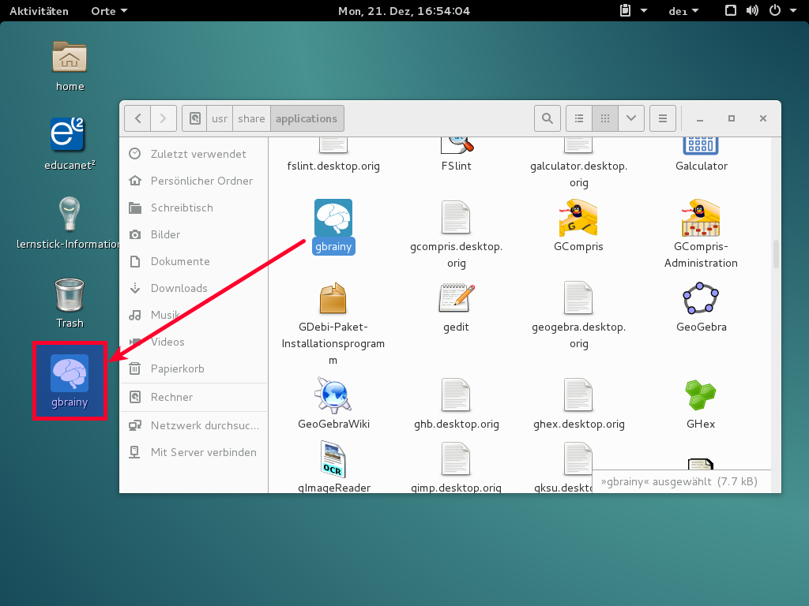

# Symbole auf Arbeitsfläche

Die Desktopumgebung GNOME zeigt üblicherweise keine Symbole auf der Arbeitsfläche an. Wir haben in der Standard-Lernstick-Umgebung diese Voreinstellung so belassen.

Hinweis: Da die Lernstick-Prüfungsumgebung auch in Situationen eingesetzt wird, in denen die AnwenderInnen die Oberfläche zum ersten Mal verwenden und in Prüfungssituationen üblicherweise nur sehr wenige Programme zum Einsatz kommen, haben wir die Konfiguration in der Prüfungsumgebung bereits schon so geändert, dass auf der Arbeitsfläche Symbole angezeigt werden. So müssen AnwenderInnen nicht erst gezeigt werden, wie und wo unter GNOME Anwendungen gestartet werden.

## Aktivierung

Falls Sie auch in der Standard-Lernstick-Umgebung Symbole auf der Arbeitsfläche anzeigen lassen wollen, lässt sich dies mit wenigen Handgriffen einrichten:
Zunächst müssen Sie das Optimierungswerkzeug starten. Wählen Sie dazu “Aktivitäten → Anwendungen anzeigen → Hilfsprogramme → Optimierungswerkzeug”:

Dort aktivieren Sie dann im Menü “Arbeitsoberfläche” die Option “Symbole auf Arbeitsfläche”:

## Programmsymbole auf der Arbeitsfläche

Falls Sie die Symbole von installierten Programmen auf der Arbeitsfläche anzeigen lassen wollen, können Sie wie folgt vorgehen:
Öffnen Sie den Pfad zu den Programmsymbolen über Orte (Punkt 1 im Bild unten) und Rechner (Punkt 2). Navigieren Sie dann zum Verzeichnis /usr/share/applications (Punkt 3). Das Programm, dessen Symbol Sie auf dem Desktop anzeigen lassen wollen, können Sie mit der rechten Maustaste anklicken (Punkt 4) und wählen dann den Menüpunkt “Kopieren” (Punkt 5):

Klicken Sie dann die Arbeitsfläche mit der rechten Maustaste an (1) und wählen den Menüpunkt “Einfügen” (2):

Das Programmsymbol sollte daraufhin auf der Arbeitsfläche erscheinen:

### Alternative Methode

Programmstarter können unter anderen Oberflächen auf konservative Art und Weise auf den Desktop gelegt werden und sind dann auch in GNOME (bzw. KDE über das Miniprogramm ’Ordner’) sichtbar.

**Cinnamon**: 
Menü -> Kategorie -> Rechtsklick auf ein Programm -> Zum Schreibtisch hinzufügen
**MATTE**:
Anwendungen -> Kategorie -> Rechtsklick auf ein Programm -> Als Starter zur Arbeitsfläche hinzufügen
**XFCE**:
Whisker-Menü -> Kategorie -> Rechtsklick auf ein Programm -> Zum Schreibtisch hinzufügen  oder das Programm einfach mit gedrückter linker Maustaste auf den Desktop ziehen.
**LXDE**:
Menü -> Kategorie -> Rechtsklick auf ein Programm -> Dem Desktop hinzufügen

Unter KDE sind diese Programmstarter dann folgendermassen erreichbar:
Rechtsklick auf den Desktop -> Miniprogramme entsperren -> Rechtsklick auf den Desktop -> Miniprogramme hinzufügen -> Kategorie: Dateisystem -> ‘Ordner’ -> Werkzeug am Ordner-Fenster -> Ort: Ordner auswählen als /home/user/Desktop -> Titel: Vollständiger Pfad ->  Rechtsklick auf den Desktop -> Miniprogramme sperren.
