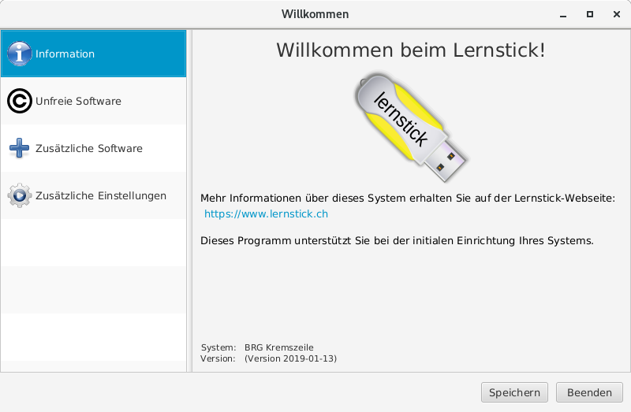
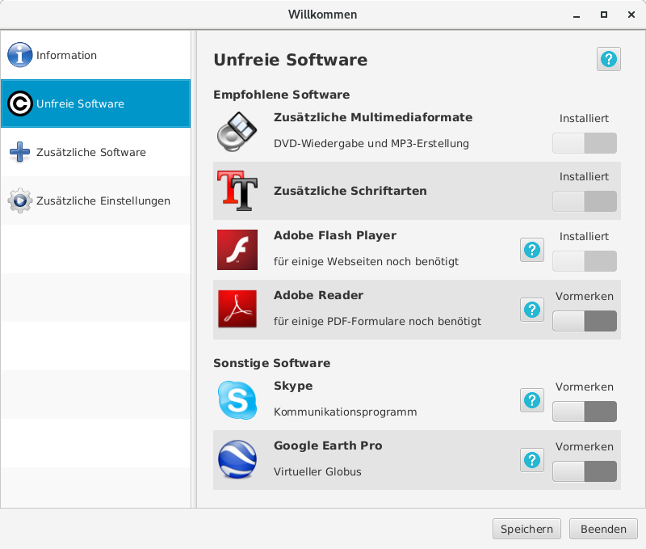
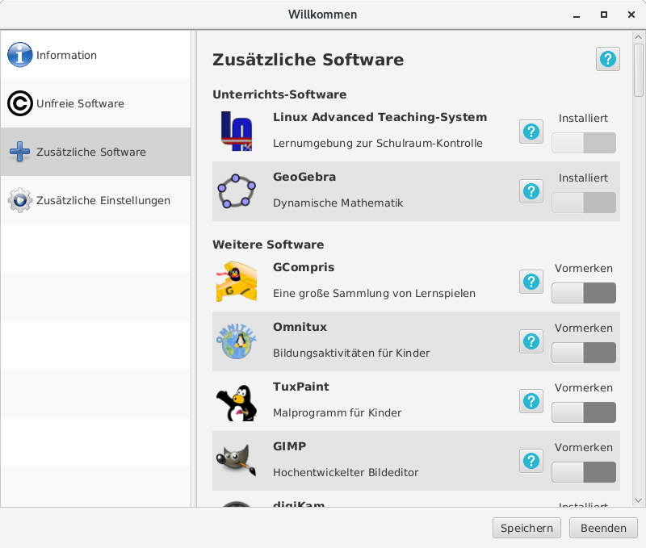
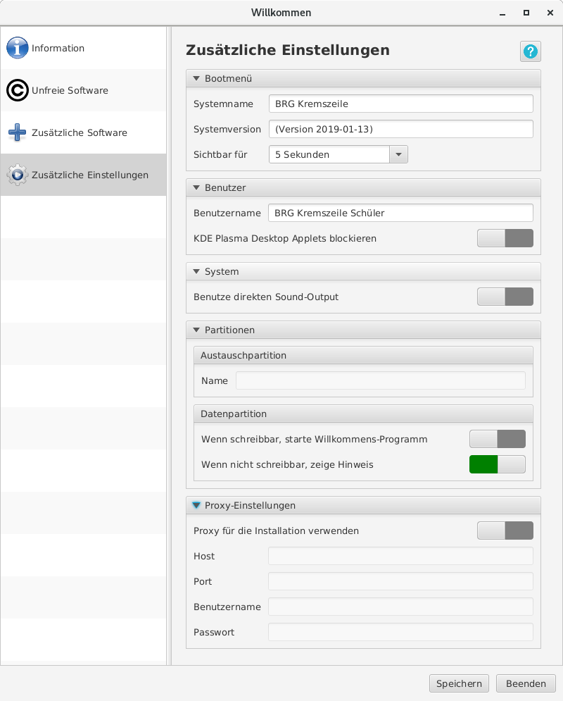
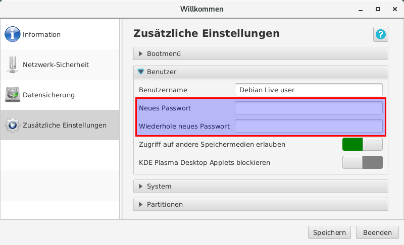
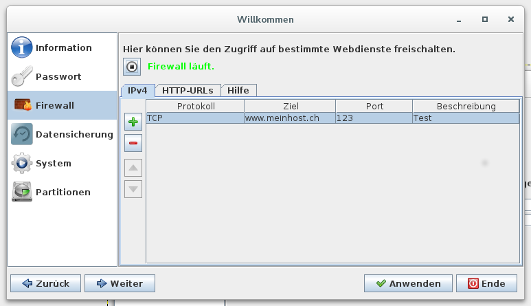
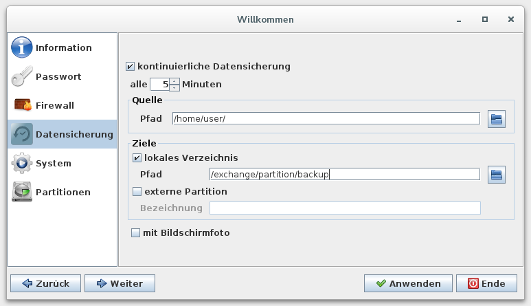

# Benutzung

# Willkommensbildschirm

Beim erstmaligen Start des Lernsticks erscheint automatisch das Willkommensprogramm. Es kann auch nachträglich über das Startmenü des jeweiligen Desktops aufgerufen werden. Der Sinn und Zweck des Willkommensprogramms liegt in der einfachen Ersteinrichtung des Systems. Es unterscheided sich zwischen der Lern- und der Prüfungsumgebung hinsichtlich der verfügbaren Menüpunkte.

## Lernumgebung
In der Lernumgebung dient das Willkommensprogramm **hauptsächlich der einfachen Installation wichtiger oder häufig genutzter Software**, die aus lizenzrechtlichen Bestimmungen zwar selbst installiert, aber nicht von Werk aus mit dem Lernstick ausgeliefert werden darf. 
Manche Programme finden alleine aus speicherplatztechnischen Gründen nicht von Haus aus Einzug im Lernstick und können so nachträglich hinzu genommen werden.

Der Menüpunkt “Information” dient tatsächlich nur dem Willkommensgruß.

Der Menüpunkt “Unfreie Software” ermöglicht die Installation von Anwendungen, die nicht einer freien Lizenz unterliegen, aber selbst legal und kostenlos installiert werden dürfen.

Der Menüpunkt “Zusätzliche Software” bietet unter anderem die Installation des **Lernstick Advanced Teaching-System** an.

Hierbei handelt es sich um eine **mobile Lernumgebung**, die dem Lehrer **ohne Konfiguration** durch einen IT-Experten (wie etwa bei iTalc) die Steuerung der Schüler PCs ermöglicht (Internet sperren, usw.).
Mit dem Lernstick Advanced Teaching-System können auch Test, Schularbeiten und Reifeprüfungen im so genannten Prüfungsmodus sicher durchgeführt werden.

Tipp: Das Lernstick Advanced Teaching-System ist nicht gleichbedeutend mit der Lernstick-Prüfungsumgebung. 

Ersteres ist eine Erweiterung des “normalen” Lernsticks und letzteres stellt eine komplett eigene, auf Prüfungen reduzierte Lernstick-Variante dar, die im Unterricht selbst nicht eingesetzt wird. 

Wie bei allen Dingen im Leben gibt es bei beiden Varianten Vor- und Nachteile. Eine optimale Empfehlung kann nur unter Einbezug der Gegebenheiten am jeweiligen Standort getroffen werden.

Tipp: Eine umfassende Dokumentation zum Lernstick Advanced Teaching-System (früher: LinuxAdvanced Teaching-System) finden Sie unter folgendem Link: [http://www.linuxadvanced.at/dokumentationen/la-ts.pdf](http://www.linuxadvanced.at/dokumentationen/la-ts.pdf)

Bei den “Zusätzlichen Einstellungen” können diverse Parameter wie der System- oder Benutzername gesetzt werden:

In manchen Schulen muss zuerst ein Proxy definiert werden, damit überhaupt auf das Internet zugegriffen werden kann:

## Prüfungsumgebung

In der Lernstick-Prüfungsumgebung stehen im Willkommensprogramm die Menüpunkte “Unfreie Software”, “Teaching-System”, “Ergänzungen” und “Proxy” nicht zur Verfügung, jedoch weitere, speziell für die Prüfungsumgebung relevante Menüpunkte:

Die Lernstick-Prüfungsumgebung ist im Auslieferungszustand noch relativ offen. Unter dem Menüpunkt “Zusätzliche Einstellungen -> Benutzer” sollte daher unbedingt ein Passwort festgelegt werden, das danach für alle administrativen Vorgänge abgefragt wird. Dieses Passwort sollte den Anwendern selbstverständlich NICHT mitgeteilt werden.

Unter dem Menüpunkt “Firewall” kann eine Whitelist von Hosts und URLs angegeben werden, auf die in der Prüfung zugegriffen werden darf. Eine Erklärung zur Syntax bei den Hosts und URLs ist im rechten Reiter “Hilfe” integriert:

Unter dem Menüpunkt “Datensicherung” können die Details zur in der Prüfungsumgebung integrierten Datensicherung eingestellt werden:

Bei den Zielen ist das lokale Verzeichnis “/exchange/partition/” der Mountpunkt der Austauschpartition des Prüfungssticks. Unter dem Punkt “externe Partition” kann das Label eines weiteren Sticks angegeben werden, auf dem aus Redundanzgründen noch eine weitere Datensicherung abgelegt wird. Falls die Option “mit Bildschirmfoto” angewählt wird, so wird zu jedem Datensicherungszeitpunkt auch noch ein Bildschirmfoto abgelegt. Dies ist zum einen für die Bildungsforschung, zum anderen auch für Beweiszwecke hilfreich.

