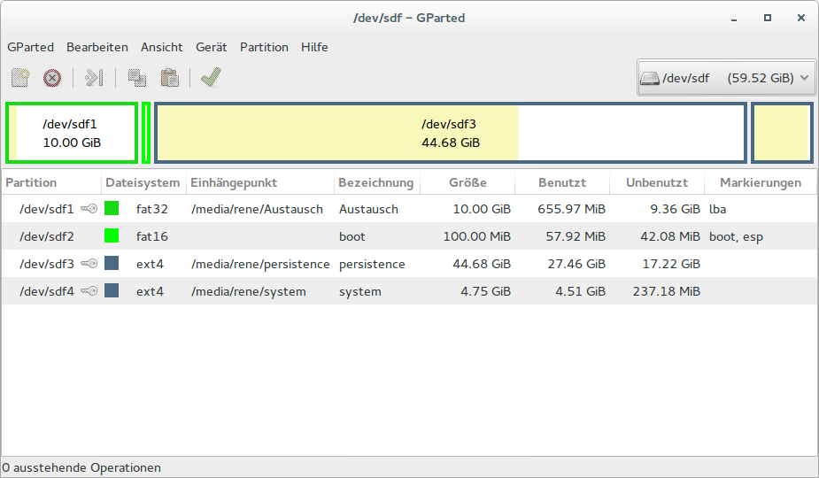
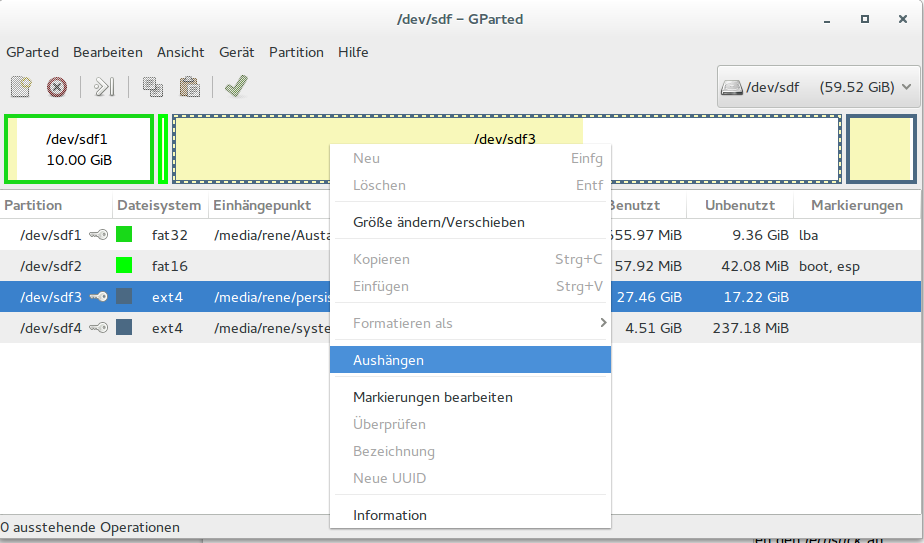
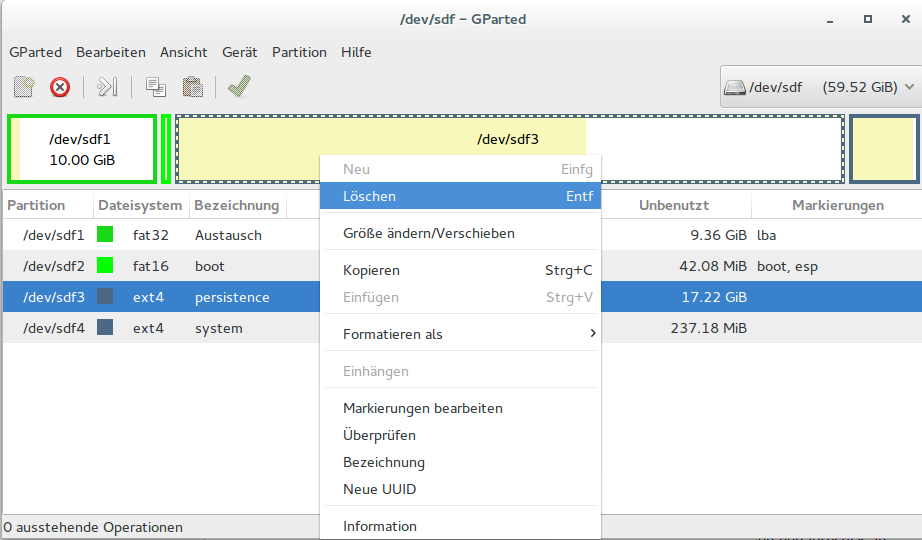
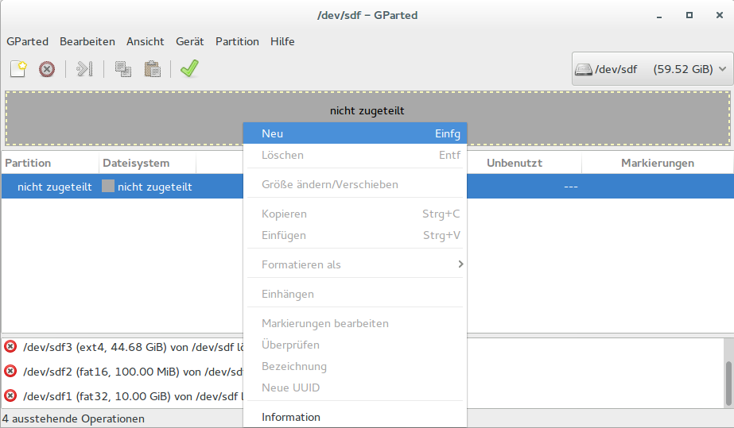
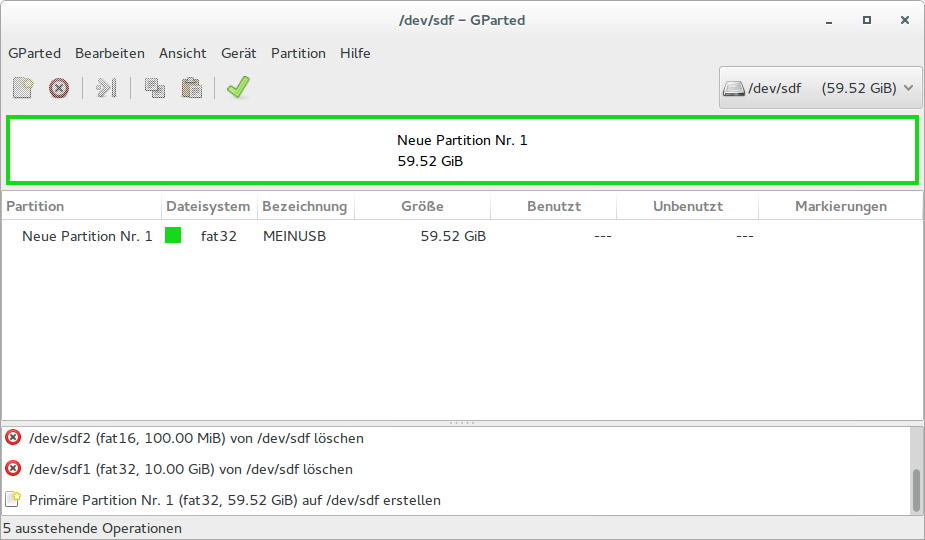
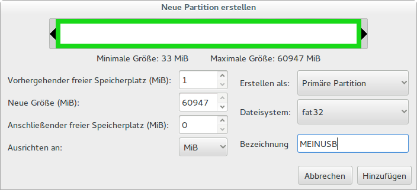

# Deinstallation

Wenn man einen Lernstick wieder zurück in einen ganz normalen USB-Datenträger umwandeln möchte, so kann man das mit folgenden Arbeitsschritten durchführen:

1. Starten Sie Ihren Computer mit einem anderen Lernstick oder Betriebssystem (z.B. Ubuntu, Linux Mint, …).

2. Stecken Sie den zu formatierenden Lernstick in einen USB-Anschluss.

3. Rufen Sie im ein Programm zur Partitionierung auf (z.B. GParted).

4. Vergewissern Sie sich, dass der richtige Datenträger ausgewählt ist (hier ein 64 GB großer USB-Stick, der als /dev/sdf mit 59,53 GB angezeigt wird).

5. Hängen Sie die einzelnen Partitionen aus:

6. Löschen Sie die einzelnen Partitionen:

7. Legen Sie eine neue FAT-32 Partition an:

8. Im Anschluss müssen alle Aktionen durch Klicken auf das grüne Häkchen bestätigt und ausgeführt werden.

Nach erfolgreichem Ausgang sollten Sie ihren USB-Stick wieder als ganz normalen Datenträger verwenden können.

