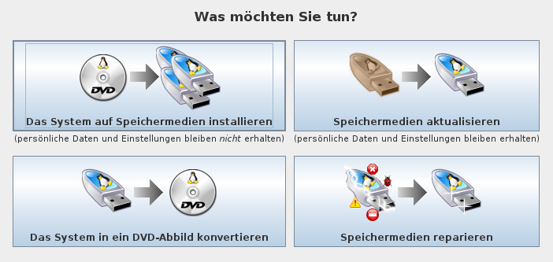
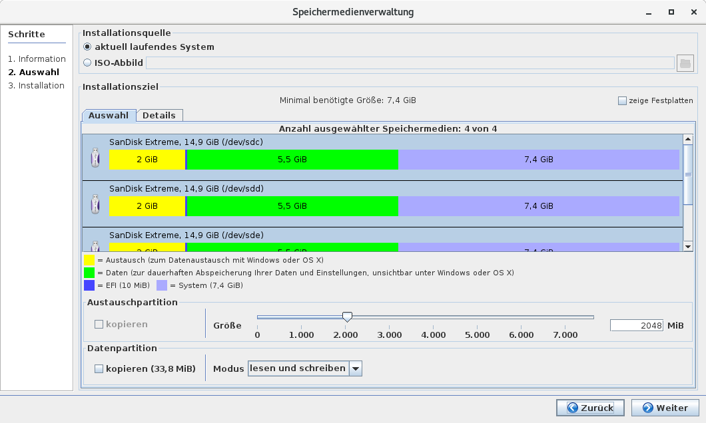

# Bespielen eines USB-Sticks

Nachdem das System von DVD bzw. in der virtuellen Maschine gestartet wurde, können Sie das Lernstick-System auf verschiedenste Speichermedien (z.B. einen oder mehrere persönliche USB-Sticks, USB-Festplatten, SD-Karten oder auch die interne Festplatte) übertragen. 

**Empfehlung**: Speichermedienverwaltungs-Operationen unter den Oberflächen LXDE, Xfce, Enlightenment oder MATE durchführen, da 'dlcopy' unter GNOME, Cinnamon oder KDE Rechner mit deutlich mehr als 2GB RAM benötigt.
*Bei Rechnern mit wenig RAM Speicher kann eine Auslagerungsdatei von 2048 MB oder mehr auf einem zusätzlichen vorher ext4-formatierten Stick vor Ausführung von 'dlcopy' angelegt werden. Das Kopieren eines MASTER-Sticks mit dieser Auslagerungsdatei dauert dann aber auch viel länger.*

Beim ersten Start öffnet sich das erforderliche Programm **“Speichermedienverwaltung”** automatisch. 
Dieses kann natürlich auch zu jedem späteren Zeitpunkt gestartet werden. 
Bei Gnome 3 brauchen Sie unter “Aktivitäten” nur die Buchstaben **“usb”** tippen und das richtige Programm-Icon wird sofort angezeigt.

Nach ein paar Sekunden sollte sich folgendes Fenster öffnen:

Wählen Sie die erste Option **“Das System auf Speichermedien installieren”**
Drücken Sie den "Weiter"-Knopf unten rechts. Wenn Sie Ihren USB-Stick noch nicht am Rechner angeschlossen haben, erscheint folgende Aufforderung:

Falls Sie das Lernstick-System auf eine Festplatte installieren wollen, müssen Sie die Option “zeige Festplatten” im oberen rechten Bereich des Fensters aktivieren:

Dann werden auch alle erkannten Festplatten in der Liste der Speichermedien angezeigt.

Nachdem Sie einen (oder mehrere) USB-Sticks an Ihren Rechner angeschlossen haben, erscheint die folgende Auswahlliste:

In diesem Beispiel wurden mehrere USB-Sticks (8 GB und 4 GB) angeschlossen. 
Das Installationsprogramm zeigt an, welche Partitionierung es bei der Installation auf den jeweiligen Sticks vornehmen würde. Wenn der ausgewählte Stick zu klein ist (siehe die Anzeige des unteren USB-Sticks in der Liste), so verweigert das Programm die Installation auf diesem USB-Stick. 

Des Weiteren kann die Größe und Bezeichnung einer **Austausch-Partition** des Lernsticks angegeben werden. 
So kann ein Lernstick auch weiterhin als gewöhnlicher Daten-USB-Speicherstick verwendet werden. 
Durch die Angabe einer eigenen Bezeichnung der Austauschpartition kann der Lernstick personalisiert und leicht wiedererkannt werden, wenn mehrere Lernsticks an einem Rechner angeschlossen werden. So könnten Sie z.B. als Bezeichnung den Namen des zukünftigen Besitzers des Sticks verwenden.

In manchen Anwendungsfällen wird eine automatische Nummerierung der Bezeichnung der Austauschpartition gewünscht. Das Muster wird in der Bezeichnung gesucht und durch die fortlaufende Nummer ersetzt, z.B.:
    Bezeichnung = "AustauschX"
    Muster = "X"
    Startwert = 1
    Erhöhung = 1
Wenn das System auf mehrere Datenträger installiert wird, so wird beim ersten Datenträger das Muster durch den Startwert ersetzt (im Beispiel oben also Austausch1), beim nächsten dann durch Startwert + Erhöhung (im Beispiel also Austausch2), usw.

Schnellformatierung ist eine Option, die nur bei der Verwendung des Dateisystem NTFS zur Verfügung steht und den Formatierungsvorgang beschleunigt, dabei aber auf das komplette Löschen der Daten auf der Partition verzichtet.

**TIPP:** Grundsätzlich ist davon auszugehen, dass Schüler außerhalb der Schule mit verschiedenen Betriebssystemen arbeiten werden. Um den Datenaustausch zwischen dem Lernstick und dem etwa zu Hause installierten Betriebssystem zu gewährleisten, sollten Sie unbedingt eine Austausch-Partition anlegen (bei einem 16 GB ca. 2-4 GB, bei größeren USB-Sticks entsprechend mehr).

Obwohl **exFAT** ein neueres Dateisystem ist als **FAT32**, zeigt folgende Tabelle, dass eine FAT-32 formatierte Austausch-Partition in vielen Fällen 1. Wahl ist.

Bei manchen Linux-Distributionen müssen für exFAT noch gewisse Pakete nachinstalliert werden.
Man sucht dazu in den Paketquellen nach ‘exfat’ und installiert vorab die relevanten Pakete.

**TIPP:** Wenn Sie die Lernstick-Prüfungsumgebung installieren, sollten Sie unbedingt eine Austauschpartition anlegen, da sie als Standard-Speicherpfad in der Prüfungsumgebung verwendet wird!

**Hinweis:** Standardmäßig ist auf einem Lernstick die Bootpartition die erste Partition und die Austauschpartition die zweite. Wenn Sie allerdings einen USB-Stick verwenden, der sich selbst als "entfernbares" Speichermedium ausgibt, legt die Speichermedienverwaltung die Partitionen in umgekehrter Reihenfolge an, also als erste Partition die Austauschpartition und als zweite Partition die Bootpartition. Der Grund dafür ist, dass Windows auf entfernbaren USB-Sticks nur die erste Partition sieht. Auf dem Lernstick soll aber die Austauschpartition die unter Windows sichtbare Partition sein. Warum Windows nur die erste Partition lesen kann, bleibt Microsofts Geheimnis…

Wenn Sie die Austauschpartition mit FAT32 formatieren (dies ist der Standard in der Prüfungsumgebung), muss die Speichermedienverwaltung auch einige Bootdateien in die Austauschpartition kopieren, da es einige Notebooks gibt, die im UEFI-Modus nur von der ersten FAT32-Partition starten.

Die Speichermedienverwaltung versucht, diese Bootdateien vor dem Anwender so gut es geht zu verstecken, damit sie nicht aus Versehen gelöscht werden können. Unter OS X und Windows sind die Dateien unsichtbar, jedoch gibt es unter Linux einige Dateimanager, die die versteckten Dateien anzeigen und auch löschen könnten. Falls Sie also entfernbare USB-Sticks einsetzen, die Austauschpartition mit FAT32 formatieren und Linux-Anwender haben, teilen Sie diesen bitte mit, dass sie die Boot-Dateien auf der Austauschpartition besser nicht löschen sollten.

Die Option im unteren Bildschirmbereich **"Datenpartitionen kopieren"** spielt bei der Installation von DVD auf USB-Stick noch keine Rolle. Sie wird erst wichtig, wenn eine Installation von einem USB-Stick auf weitere USB-Sticks vorgenommen wird.

Wählen Sie die gewünschten USB-Sticks aus der Liste aus. Mehrere USB-Sticks können Sie durch Drücken von Ctrl und Anklicken mit der linken Maustaste auswählen (und auch wieder abwählen). Wenn Sie alle gewünschten USB-Sticks ausgewählt haben, drücken Sie den "Weiter"-Knopf. Da alle vorhandenen Daten auf den ausgewählten USB-Sticks gelöscht werden, erscheint vorher noch die folgende Warnung:

Wenn Sie sich sicher sind, die richtigen USB-Sticks ausgewählt zu haben, drücken Sie den "Ja"-Knopf. Daraufhin werden auf allen ausgewählten USB-Sticks nacheinander folgende Aktionen durchgeführt:
1) Partitionierung des USB-Sticks und Formatierung der erstellten Partitionen mit den benötigten Dateisystemen:

2) Kopieren der Systempartition auf den USB-Stick:

Im oberen Bildschirmbereich wird angezeigt, auf welchen der ausgewählten USB-Sticks die Installation gerade erfolgt. Im Fortschrittsbalken in der Bildschirmmitte wird angezeigt, wie viele Daten schon kopiert worden sind, wie viele Daten insgesamt kopiert werden müssen, wie schnell der Kopiervorgang vonstatten geht und wieviel Prozent des Kopiervorgangs bereits abgeschlossen sind. 
In der Zeile darunter wird angegeben, wie lange der Kopiervorgang bis jetzt gedauert hat, wie lange er voraussichtlich insgesamt dauern wird, wie lange er ab jetzt noch dauern wird und was der geschätzte Zeitpunkt der Fertigstellung ist.

Wenn der Kopiervorgang abgeschlossen ist, wird der USB-Stick noch bootfähig gemacht, dass heißt, es wird ein so genannter Bootsektor auf den USB-Stick geschrieben.

Danach ist die Installation auf dem USB-Stick abgeschlossen:

Klicken Sie auf den Button **“Fertig”** und ziehen Sie den bespielten USB-Stick ohne ihn speziell auszuwerfen ab.

Sollte es Probleme mit ‘dlcopy’ in VirtualBox geben, können Sie auch die Virtualisierungslösung VMware Player anstelle von VirtualBox verwenden.