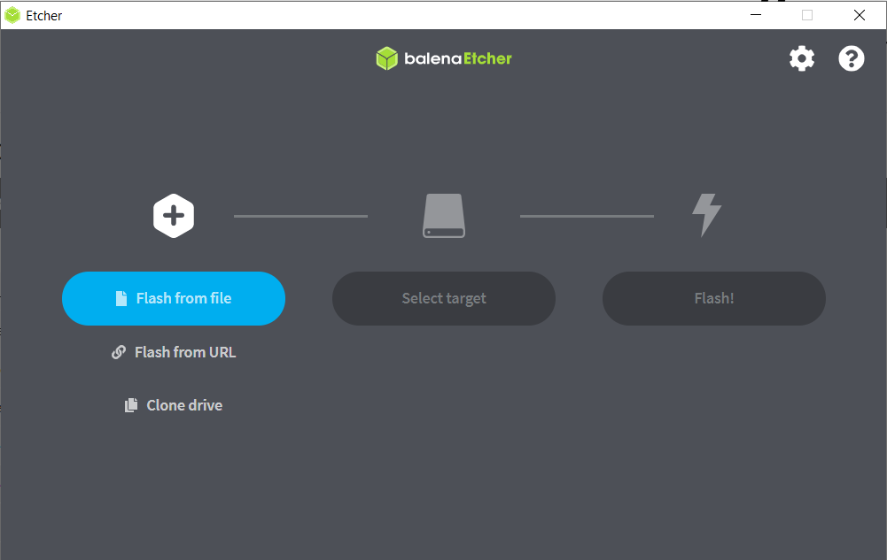
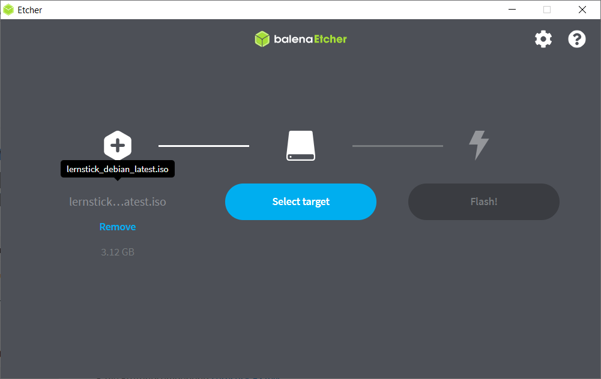
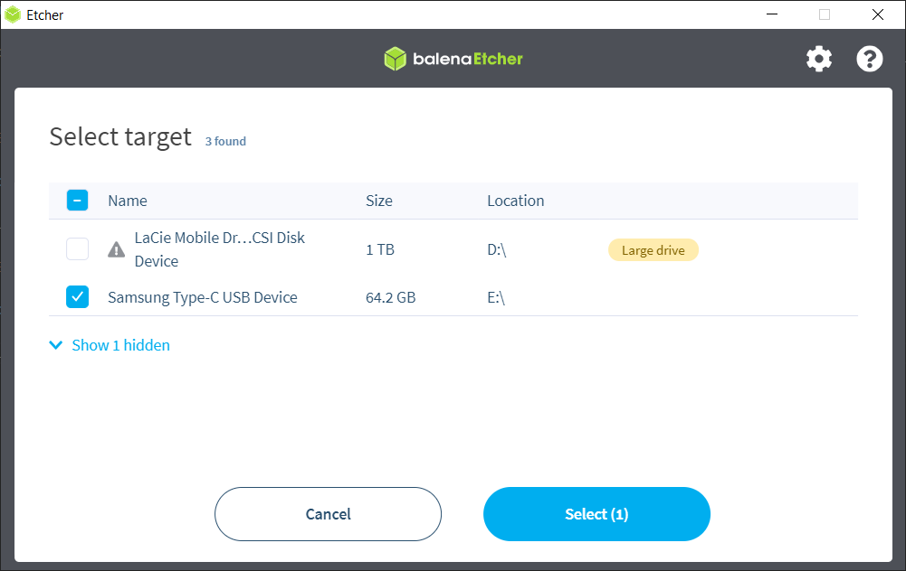
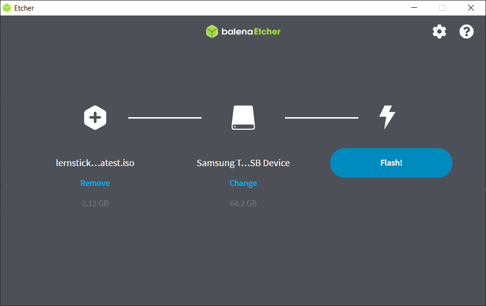
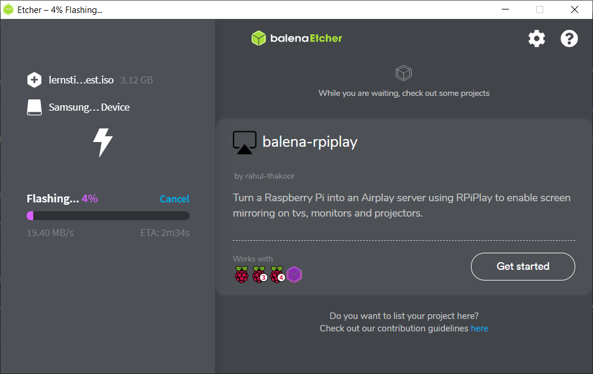
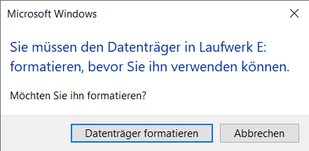

# Image auf Stick flashen

Die einfachste Art das Lernstick-ISO auf einen USB-Stick zu bespielen, ist über die Anwendung [Etcher](https://www.balena.io/etcher/).

Laden Sie die Software herunter und installieren Sie diese. Wenn Sie die Anwendung öffnen, präsentiert sich Ihnen folgendes Fenster:

## Schritt 1: Auswählen des Image

Klicken Sie auf _Flash form file_ und wählen Sie im Explorer das heruntergeladene Lernstick ISO-File aus.

## Schritt 2: Auswählen des Speichermediums

Klicken Sie auf _Select target_ und wählen Sie im Explorer den gewünschten USB-Stick aus und bestätigen Sie ihre Auswahl.

## Schritt 3: Flashen des Sticks

Klicken Sie nun auf _Flash_ um den Prozess zu starten. Falls Windows Sie um Berechtigung fragt, müssen Sie diese freigeben.

Sobald der Prozess abgeschlossen ist, wird Windows Sie auffordern den USB-Stick zu formatieren, da dieser nun nicht mehr als verwendbar anerkannt wird. Klicken Sie auf _abbrechen_.

Nun kann das Lernstick OS vom bespielten USB-Stick gebootet werden.