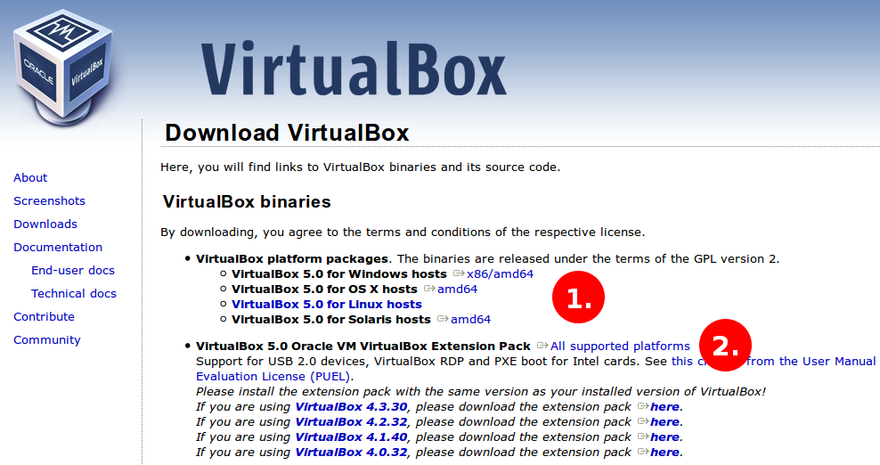
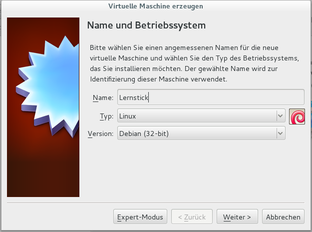
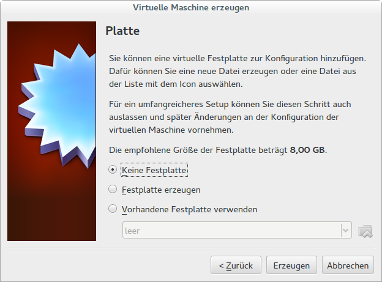
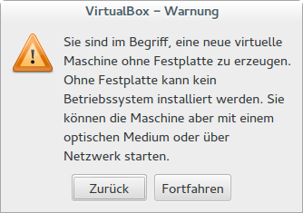
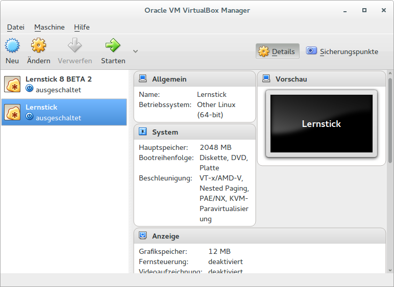
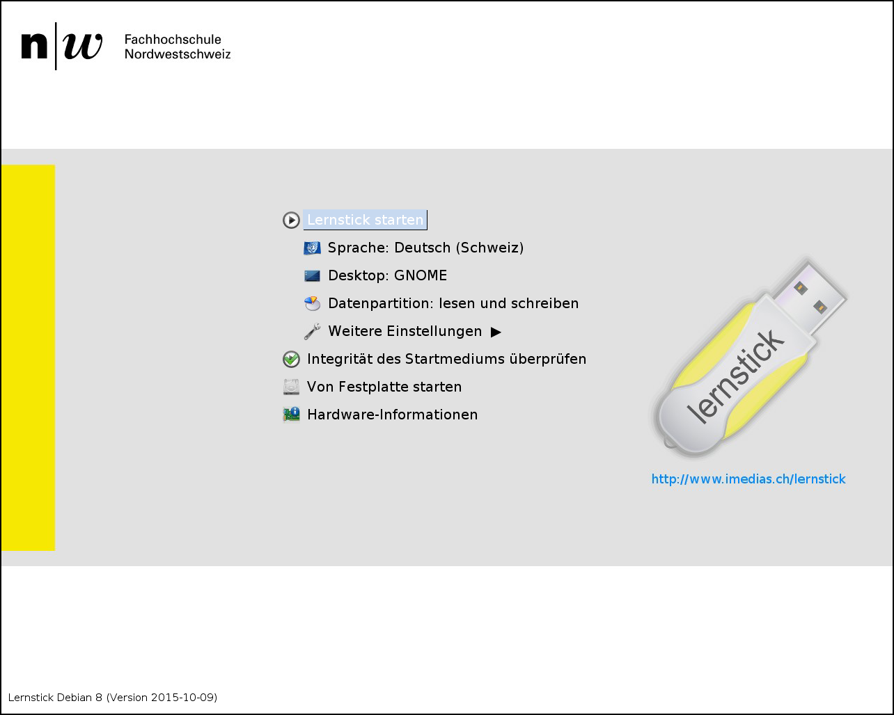
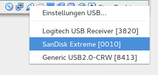

# Variante 2: Starten mit Hilfe einer virtuellen Maschine
Einige fortgeschrittene Anwender empfinden es als umständlich, nachdem das Lernstick-DVD-ISO-File heruntergeladen wurde, erst eine DVD brennen zu müssen, damit das Lernstick-System installiert/genutzt werden kann. Dieser Schritt kann ausgelassen werden, indem man das Lernstick-System mit Hilfe einer virtuellen Maschine startet. Danach kann aus der virtuellen Maschine heraus ein Lernstick (= USB-Stick) erzeugt werden.
Dies soll hier am Beispiel von [VirtualBox](https://www.virtualbox.org/), einer freien Virtualisierungslösung gezeigt werden:

**<span style="color:red">Wichtig: </span>** Für den Fall, dass Sie unter Windows aus irgendeinem Grund die Funktion “Hyper-V” aktiviert haben, deaktivieren Sie sie bitte wieder. Die Hyper-V-Funktion verhindert den reibungslosen Betrieb von VirtualBox. Wie Hyper-V deaktiviert werden kann, ist z.B. hier beschrieben:
[https://support.bluestacks.com/hc/de/articles/115004254383-Wie-deaktiviere-ich-Hyper-V-in-Windows-](https://support.bluestacks.com/hc/de/articles/115004254383-Wie-deaktiviere-ich-Hyper-V-in-Windows-)


## Download & Installation von VirtualBox Version 5



Wählen Sie zuerst die Version für Ihr Betriebssystem aus und laden Sie im Anschluss auch das passende Extension Pack runter. Das Extension Pack ist erforderlich, damit VirtualBox auf den USB-Stick zugreifen kann.
Installieren Sie zuerst VirtualBox und danach das Extension Pack (etwa durch Rechtsklick im Dateimanager -> Öffnen mit VirtualBox).

**<span style="color:red">TIPP:</span>** Um VirtualBox sinnvoll verwenden zu können, muss man unter Linux Mitglied der Gruppe "vboxusers" sein. Falls dies noch nicht der Fall sein sollte, öffnen Sie das Terminal und geben Sie folgenden Befehl ein:

```bash
sudo usermod -a -G vboxusers $USER 
```

Danach muss man sich in der grafischen Oberfläche neu anmelden.

## Einrichten des Lernsticks in VirtualBox



Wählen Sie für den Typ des Betriebssystems “Linux” und als Version bis zum Lernstick 8 “Debian (32-bit)” und für Lernstick 9 oder später “Debian (64-bit)” aus.
Je nachdem über wie viel **Arbeitsspeicher** Ihr Rechner verfügt, geben Sie ca. ein Viertel bis die Hälfte davon (**<span style="color:red">jedoch deutlich über 1024 MB, bis die Meldung “Ungültige Einstellungen erkannt“ verschwindet</span>**) im nächsten Schritt der virtuellen Maschine.


Um lediglich einen Basis-Lernstick zu erzeugen, ist keine Festplatte in der virtuellen Maschine erforderlich:



Die Warnung im Anschluss können Sie beruhigt wegklicken (-> Fortfahren):



Sie haben nun Ihre virtuelle Lernstick-Maschine fast fertig eingerichtet. 
Um später beim Bespielen Ihres USB-Sticks die Schreibraten von **USB 3.0** nutzen zu können, müssen Sie noch den passenden Controller einstellen. Wählen Sie hierzu den Eintrag “Ändern” bei Ihrer virtuellen Lernstick-Maschine:




Für neuere Lernstick-Versionen sind die Voreinstellungen von VirtualBox leider nicht mehr passend, so dass Sie noch ein paar weitere Einstellungen vornehmen müssen:

Unter “System -> Hauptplatine -> Erweitert” müssen Sie die Option “IO-APIC” auswählen und unter “System -> Prozessor” die Anzahl der Prozessoren so weit erhöhen, bis sie auf der Grenze zwischen dem grünen und roten Bereich liegen. Ausserdem muss darunter die Option “PAE/NX aktivieren” ausgewählt werden.

Für eine zuverlässige Tonausgabe sollten Sie unter “Audio -> Audio-Controller” die Option “Intel HD Audio” auswählen.

Damit die virtuelle Netzwerkverbindung zuverlässig einen guten Durchsatz bietet, sollten Sie unter “Netzwerk -> Adapter 1 -> Erweitert -> Adaptertyp” die Option “PCnet-FAST III” auswählen.

Bestätigen Sie Ihre Änderungen und starten Sie danach den virtuellen Lernstick. VirtualBox möchte nun wissen, von welchem Medium es booten soll. 
Klicken Sie hierzu auf das gelbe Ordner-Symbol und wählen Sie die zuvor heruntergeladene und überprüfte Lernstick-ISO-Datei aus.


Wenn alles funktioniert hat, erscheint im nächsten Schritt schon der Boot-Screen des Lernsticks:



Die virtuelle Maschine startet dann das Lernstick-System (nach Bestätigen eines Hinweises zum Testmodus) automatisch. 

Danach kann man den zu bespielenden USB-Stick an seinen Computer stecken, 
mit der **rechten**(!) Maustaste den **USB-Geräte-Knopf** (rechts unten in VirtualBox) anklicken und den USB-Stick aus der Liste der erkannten USB-Geräte auswählen. Dieser ist nun in der virtuellen Maschine verfügbar.



Nun kann das Lernstick-Installationsprogramm ganz normal durchlaufen werden. 
**<span style="color:red">TIPP:</span>** Nach erfolgreicher Installation sollte man wieder mit der **rechten**(!) Maustaste den USB-Geräte-Knopf anklicken und den USB-Stick abwählen, um ihn aus der virtuellen Maschine zu entfernen. Danach kann der USB-Stick auch von der realen Maschine abgezogen werden.