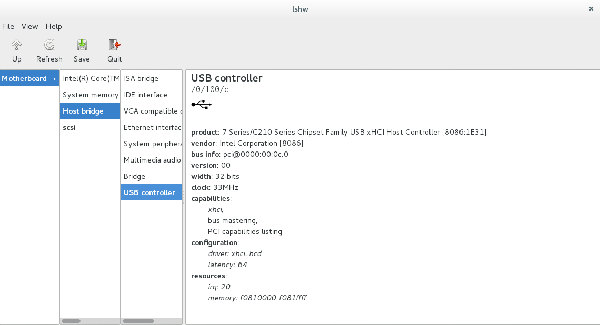

# Fehlerdiagnose

Wenn ein Computer mit dem Lernstick nicht richtig funktioniert, so ist es empfehlenswert, das Programm "Hardware-Übersicht" zu starten. 
Mit diesem Programm kann die Hardware des Computers wie mit einem Dateimanager einfach durchsucht werden (siehe nächstes Bild).

Wenn man diese Informationen jemand anderem zur Fehlerdiagnose zur Verfügung stellen möchte, so kann man die gesamte Übersicht in einer Text- oder HTML-Datei abspeichern.

Dazu muss man den Menüeintrag "File→Save" aufrufen und im Speichern-Dialog einen Dateinamen angeben.
 
Lässt man den eingegebenen Dateinamen auf ".txt" enden, so wird eine Textdatei abgespeichert, lässt man ihn auf ".html" enden, wird eine HTML-Datei abgespeichert.

Die HTML-Datei lässt sich mit einem Webbrowser öffnen und hat optische Hervorhebungen, die die Navigation durch das Dokument vereinfachen, ist dafür allerdings auch etwas größer als die einfache Textdatei.
Die abgespeicherte Datei kann dann z.B. per E-Mail verschickt werden.

TIPP: Wenn der Lernstick schon beim Booten Probleme bereitet, sollte im Bootmanager unter den erweiterten Einstellungen die Statusmeldungen aktiviert werden!