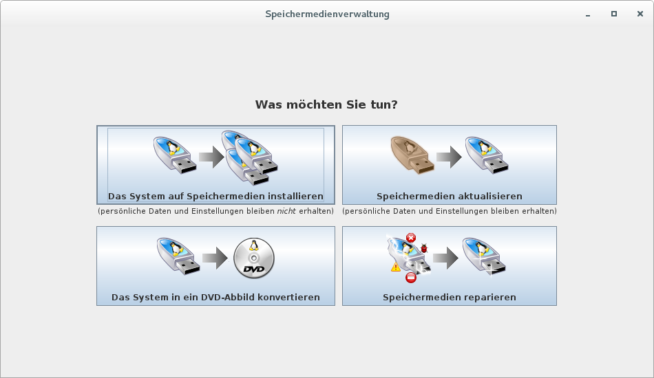
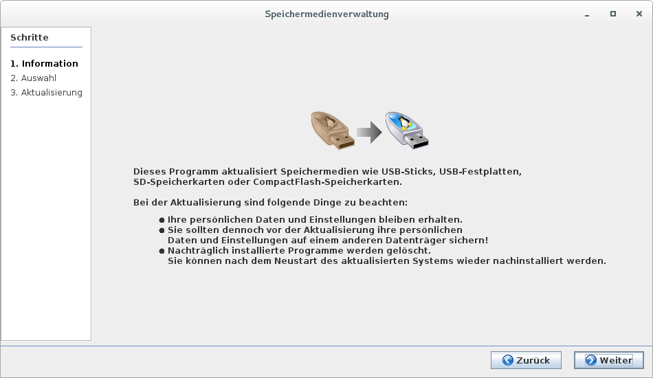
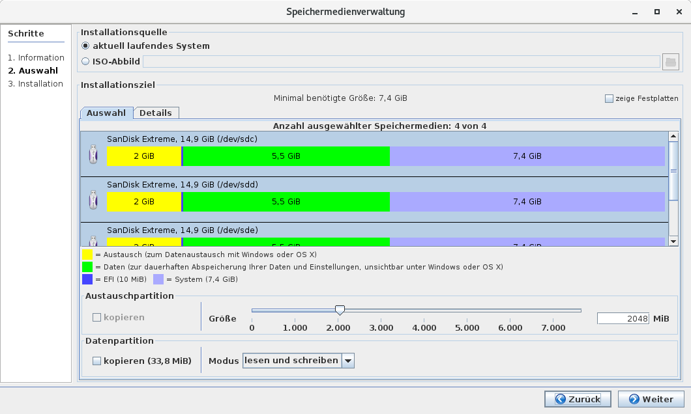
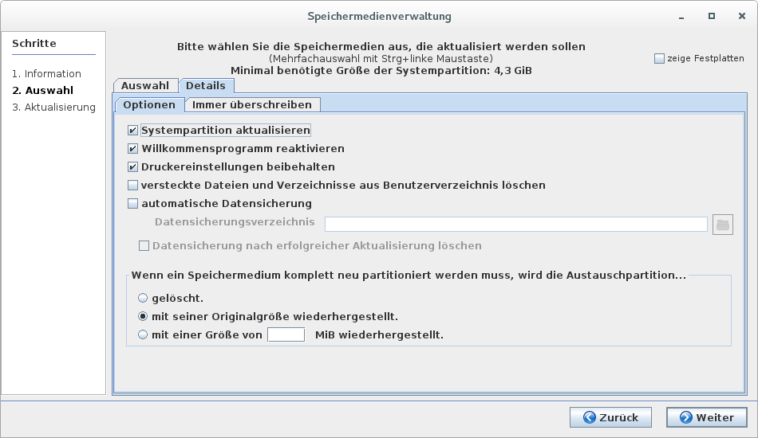
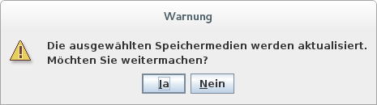

# Speichermedienverwaltung

Die Speichermedienverwaltung bietet neben der Erstellung eines Lernsticks auch noch weitere nützliche Tools:

# Speichermedien aktualisieren

Dieser Punkt ist sehr ähnlich wie “Das System auf Speichermedien installieren”,  unterscheidet sich aber vor allem in der Tatsache, dass hier persönliche Daten und Einstellungen in der Datenpartition erhalten bleiben.
Vorrangig wird diese Funktion bei der Aktualisierung auf eine neuere Lernstick-Version mit einer heruntergeladenen ISO-Datei verwendet. Auf dem Zieldatenträger wird die Systempartition mit dem Inhalt der ISO-Datei neu beschrieben.
Nachträglich installierte Programme werden bei diesem Vorgang jedoch gelöscht und müssen neu wieder installiert werden!

Neben dem Register Auswahl findet man im Register Details einige Einstellungsmöglichkeiten. Wie bei allen System kritischen Änderungen ist auch hier eine Datensicherung empfehlenswert!

Die Option “Immer überschreiben” unter “Details” bietet noch die Auswahl einzelner Verzeichnisse - diese Möglichkeit sollte aber eher von fortgeschrittenen Anwendern in Betracht gezogen werden.

Wie bei allen Prozessen, die einen “neuen” Lernstick erzeugen, sollte man nun noch einmal kurz überlegen ob man nichts vergessen hat und diese Aktion auch wirklich durchführen möchte. 
Der Rest ist dann analog zum Bespielen eines Lernsticks.

