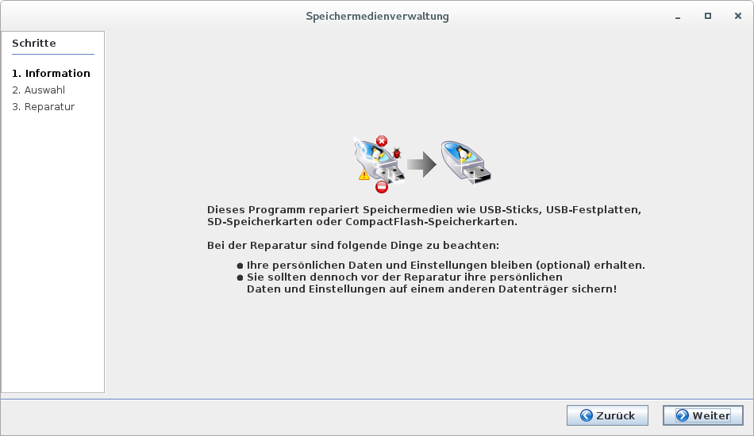
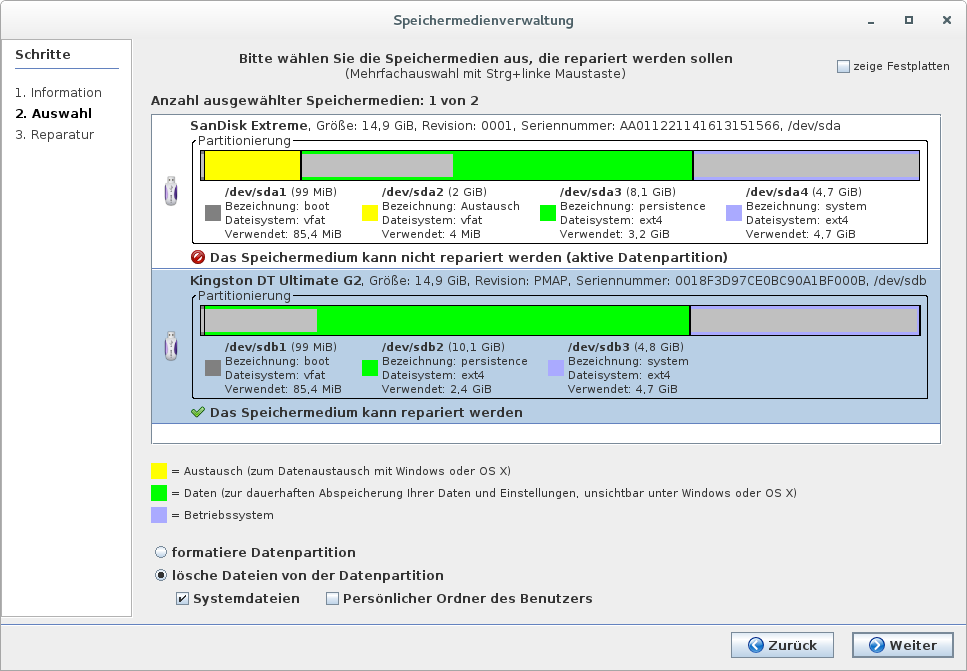
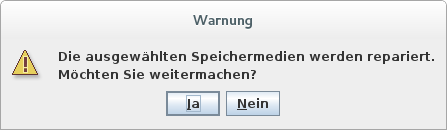

# Speichermedien reparieren

Manchmal kann es vorkommen, dass ein Lernstick nicht mehr ordentlich seinen Dienst verrichtet. Bevor man diesen neu bespielt, kann die Option “Reparieren” angewendet werden.

Im nächsten Fenster wird auch der Lernstick angezeigt, von dem gebootet worden ist - dieser kann aber nur zur Reparatur ausgewählt werden, wenn im Bootmenü der Modus der Datenpartition auf “nicht verwenden” gesetzt wurde. Ein anderer Lernstick, der nachträglich angesteckt worden ist, kann jederzeit repariert werden.

Diese Funktion auf ein intaktes Speichermedium anzuwenden bringt keine Reparatur im eigentlichen Sinne, sondern es handelt sich um Löschungen (bzw. Formatierung) in der Datenpartition. Es handelt hier um ein definiertes Zurücksetzen auf den Ursprungszustand des Speichermediums.

Wenn die Systemdateien gelöscht werden oder die Datenpartition formatiert wird, werden aktualisierte oder zusätzlich installierte Pakete aus der Datenpartition gelöscht.

Wenn man einen angepassten MASTER-Stick erstellt hat, sollte man diesen erst einmal in ein DVD-Abbild konvertieren, um alle Anpassungen in die Systempartition zu verlegen. Von diesem DVD-Abbild (Lernstick.iso) sind dann die zu verteilenden Speichermedien zu erstellen.

Nur wenn man die so generierten Sticks auf den definierten Ausgangszustand des MASTER-Sticks zurücksetzen will, ist diese Funktion **"Speichermedien reparieren"** das geeignete Mittel.

Ansonsten ohne den Umweg über das DVD-Abbild (Lernstick.iso) sind alle Anpassungen
des MASTER-Sticks weg und man hat die Situation des Lernstick-Originals.

Wie bei allen Prozessen, die einen “neuen” Lernstick erzeugen, sollte man nun noch einmal kurz überlegen ob man nichts vergessen hat und diese Aktion auch wirklich durchführen möchte. 

Der Rest ist dann analog zum Bespielen eines Lernsticks.

