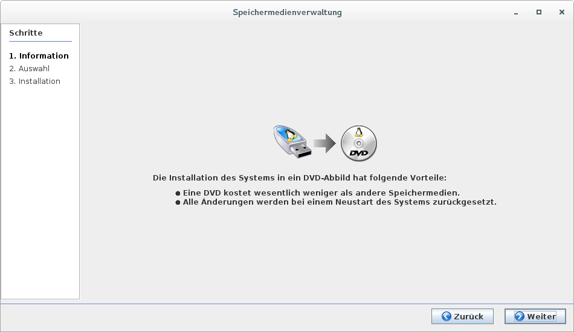
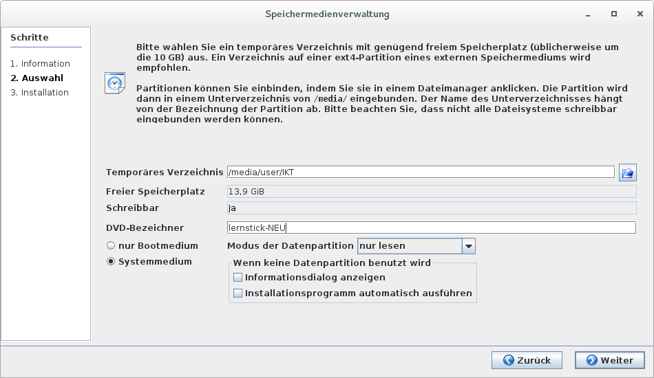
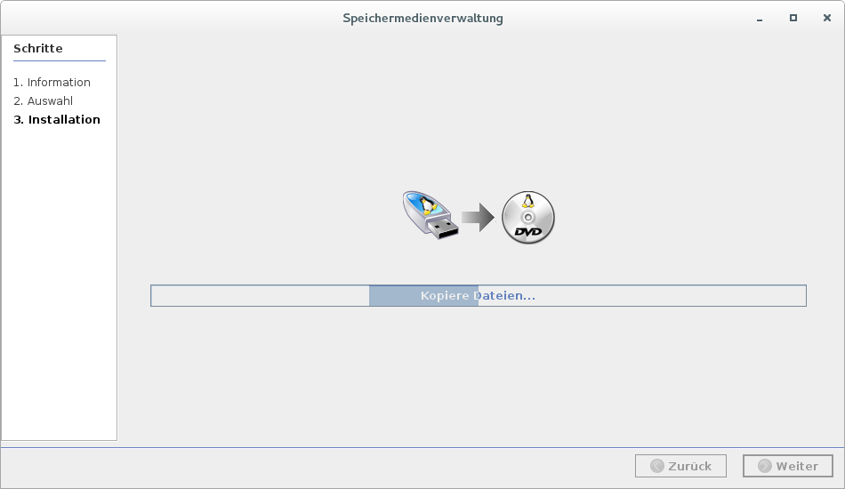
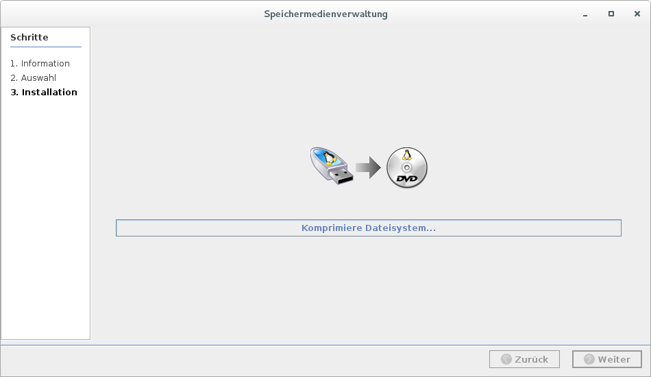
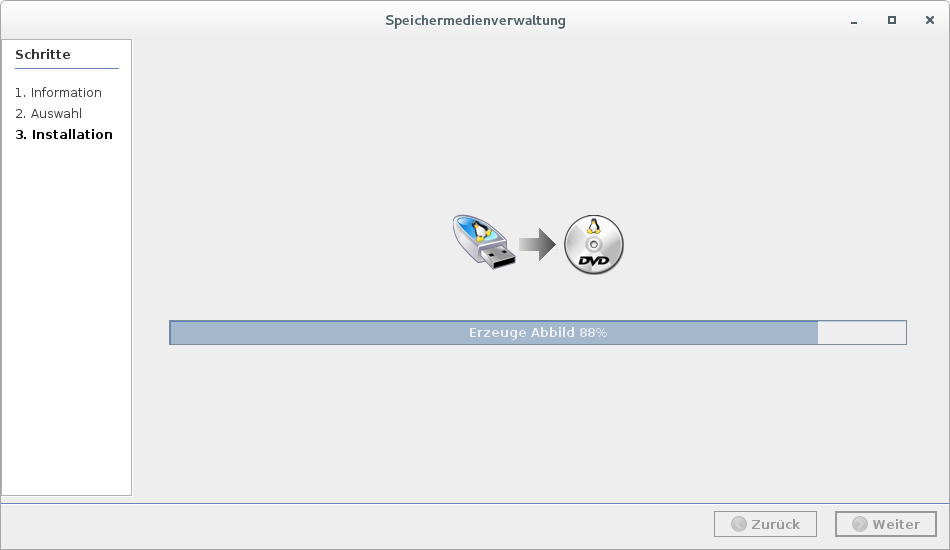
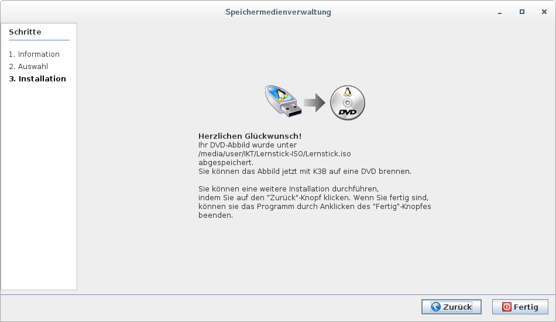

# Das System in ein DVD-Abbild konvertieren

In einigen Fällen kann es erwünscht sein, sich seinen eigenen Lernstick von Grund auf neu zu erstellen. 
Werden bei einem MASTER-Stick im Lese-Schreib Modus etwa Programme entfernt oder hinzugefügt, ändert das nichts am belegten Speicherplatz der Systempartition. 
Alle solche Änderungen werden in der Datenpartition abgelegt.
Baut man sich jedoch sein eigenes ISO-File neu zusammen, ist eine maximale Anpassung möglich. Hinzugefügte Programm und Einstellungen gelangen in die ‘neue’ Systempartition auf der als DVD-Abbild generierten Lernstick.iso

Wichtig ist hier, ein ausreichend großes temporäres Verzeichnis (Empfehlung: 32 GB oder größer) anzugeben. Dies kann etwa ein weiterer USB-Stick oder eine externe Festplatte sein. Dabei gilt es jedoch auf ein passendes Dateisystem (ext4, NTFS, …) zu achten, welches Dateien größer als 4 GB zulässt! Das oft übliche FAT-Dateisystem ist hier nicht geeignet.
Am besten formatiert man sich mit ‘gparted’ einen mindestens 32 GB grossen Stick als eine einzige ext4-Partition, versieht die Partition mit einer Bezeichnung und hängt sie in /media/x (z.B. mit ‘dolphin’)  ein.

Im ersten Schritt werden nur einige grundlegenden Dateien kopiert:

Im zweiten Schritt wird das Dateisystem für die neue Systempartition komprimiert - dies kann je nach Geschwindigkeit des Computers und Grösse des neuen Abbildes etwas (mehrere Minuten bis Stunden) dauern:

Im dritten Schritt wird aus allen kopierten und erzeugten Dateien das neue ISO-Abbild erzeugt - auch dies kann wieder etwas (üblicherweise nur wenige Minuten) dauern:

Wie immer weist zum Schluss ein Fenster auf Erfolg oder Misserfolg hin:

Von dieser auf dem Zwischenspeicher-Stick  befindlichen ‘/media/x/Lernstick-ISO/Lernstick.iso’ lassen sich nun gemäss dem Punkt “Bespielen eines USB-Sticks” beliebig viele Lernsticks mit einer angepassten Systempartition erstellen.

Will man die Lernstick.iso zuvor auf eine DVD brennen, ist zu beachten, dass man evtl. eine 8 GB DVD benötigt, weil die Systempartition angewachsen ist.

