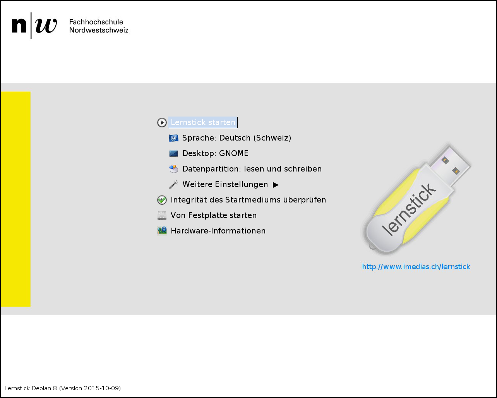

# Startbildschirm

Beim Start des Lernsticks wird zunächst ein Startbildschirm angezeigt:

Die Maus ist in diesem Schritt des Startvorgangs noch nicht aktiviert. Die Bedienung des Startbildschirms erfolgt ausschließlich über die Tastatur.

Wenn Sie den Lernstick einfach mit den Voreinstellungen starten wollen, ohne an der Konfiguration etwas ändern zu wollen, müssen Sie nichts tun. Nach einigen Sekunden wird das System automatisch gestartet. Die Wartezeit können Sie auch verkürzen, indem Sie Return oder Enter drücken, dann wird das System sofort gestartet.

Tipp: Der Lernstick merkt sich beim nächsten Start die zuletzt getätigten Einstellungen im Bootmenü.

Im Startbildschirm können über die Pfeiltasten [hoch/runter] verschiedene Aktionen ausgewählt und mit Enter oder Return bestätigt werden:

* **Sprache**
* **Desktop**
Seit dem Lernstick 8 ist GNOME der Standard-Desktop. Dies ist u.a. in der guten Unterstützung von Touch-Bedienung und hochauflösenden Displays begründet.

* **Datenpartition**
Es stehen 3 Modi zur Verfügung, wobei “lesen und schreiben” dem gewohnten Standard entspricht.
Gerade für den Einsatz an Schulen ist auch die Option “nur lesen” interessant, die beim nächsten Start alle Änderungen wieder verwirft.

* **Weitere Einstellungen**

**Tastatur**: Standard Deutschland für den deutschsprachigen Raum

**Systemgerät**: möchte man von einem Gerät mit installiertem Lernstick von USB starten, kann man hier einstellen, dass nicht die Systempartition des installierten Systems genommen wird, sonder jene vom USB-Stick.

**Datengerät**: analog wie Systemgerät nur für die Datenpartition.

**Auslagerungspartition verwenden**: Swap-Speicher zur Entlastung des RAM

**Auslagerungsdatei verwenden**: siehe Auslagerungspartition (funktioniert aber nur mit FAT-32 formatierter Austauschpartition und nicht mit exFAT)

**Lokalen APIC-Timer verwenden**: Kernel-Parameter "nolapic_timer" für spezielle Notebooks

**Dynamische Timer-Ticks verwenden**: Kernel-Parameter "nohz" für spezielle Notebooks

**Startmeldungen anzeigen**: Anstatt einer einfachen grafischen Anzeige werden detaillierte Meldungen über den Startvorgang auf dem Bildschirm angezeigt. So können Probleme mit einer bestimmten Hardware unter Umständen einfacher erkannt werden.

**Debugmeldungen anzeigen**: Es werden noch detailliertere Startmeldungen auf dem Bildschirm angezeigt.

* **Integrität des Startmediums überprüfen**
Dieser Menüpunkt ist dazu da, eine gestartete DVD auf Fehler (z.B. aufgrund von Kratzern) zu überprüfen. Die Überprüfung funktioniert nur mit einer DVD, nicht mit einem fertig installierten USB-Stick.

* **Von Festplatte starten**
Überspringt den Lernstick beim Startvorgang und wechselt zum nächsten im BIOS konfigurierten Startmedium. Dies sollte in den meisten Fällen die Festplatte sein.

* **Hardware-Informationen**
Falls der Lernstick auf einem bestimmten Computer nicht erfolgreich gestartet werden kann, ist es über diesen Menüeintrag möglich, zumindest die im Computer vorhandenen Hardwarekomponenten zu untersuchen und z.B. auch eine Überprüfung des Arbeitsspeichers vorzunehmen.