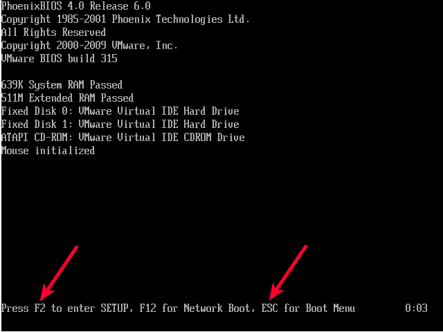
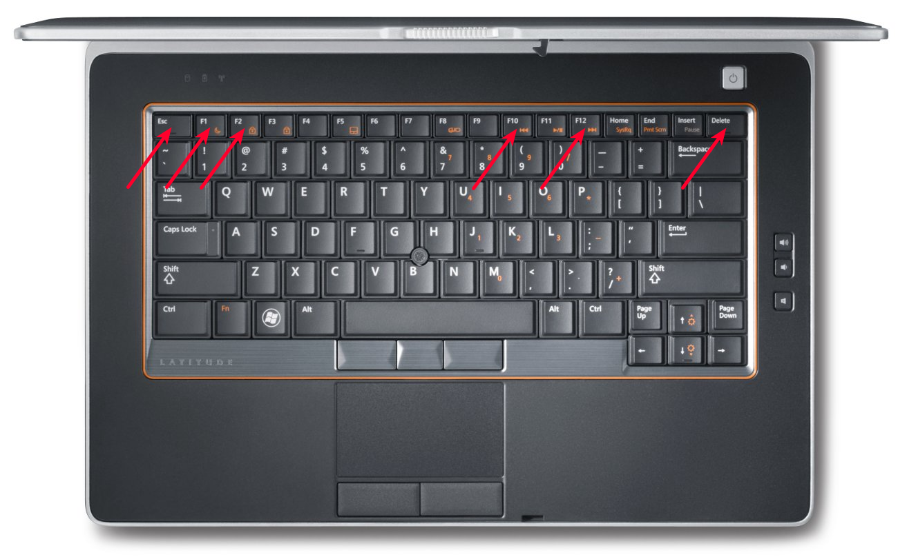
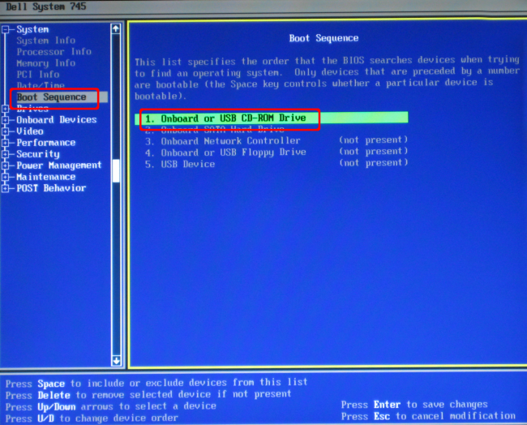
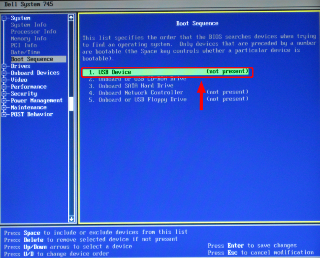
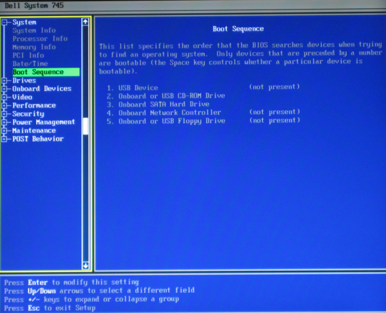
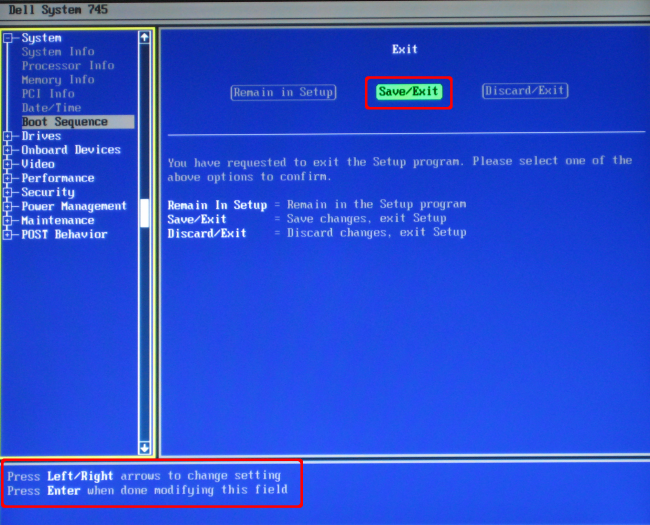

# Starten via BIOS

Wenn Sie einen älteren Rechner haben, so sollten Sie nach dem Anschalten die Ausgaben auf dem Bildschirm genau beobachten.
In den meisten Fällen wird für wenige Sekunden angezeigt, mit welcher Tastenkombinationen Sie das Startmedium auswählen können oder in die BIOS-Einstellungen gelangen können:

Wenn Sie eine solche Ausgabe nicht sehen können, schlagen Sie bitte im Handbuch des Computers nach oder probieren Sie einfach die üblichen Tasten aus. 

Die gebräuchlichsten Tasten sind: **F2, Esc, F1, F10, F12 oder Delete**:

## Beispiel: Dell-BIOS

Im folgenden Abschnitt wird exemplarisch erklärt, wie ein Dell-BIOS so konfiguriert wird, dass der Computer vom Lernstick startet. Die Konfiguration anderer BIOSe erfolgt ähnlich.

1. Stecken Sie den Lernstick in einen USB-Anschluss Ihres Computers und starten Sie den Computer neu.

2. Auf dem Bildschirm erscheint für einen kurzen Augenblick der Hinweis "F2 = Setup" (siehe rechts oben in der nächsten Abbildung). Drücken Sie also während diese Anzeige sichtbar ist die Taste [F2], um ins BIOS zu gelangen.

3. Nun erscheint eine Übersicht mit weißem Text auf blauem Hintergrund. (Die Maus funktioniert in diesem Modus nicht!)

Wählen Sie mit den Pfeiltasten den Menüpunkt "Boot Sequence" auf der linken Seite aus und bestätigen Sie die Auswahl mit [ENTER]. Der aktive Punkt ist jeweils grün hinterlegt.

4. Hier wird eingestellt, in welcher Reihenfolge der Computer nach einem Betriebssystem sucht, welches er starten kann.
Mit den Pfeiltasten können Sie die einzelnen Geräte (Festplatte, CD-ROM-Laufwerk, Diskette und USB-Stick) anwählen. Mit den Tasten [D] ("Down" - nach unten verschieben) und [U] ("Up" - nach oben verschieben), können Sie die Reihenfolge so anpassen, dass der Lernstick (USB Device) an oberster Stelle steht.
    1. USB-Device                (USB-Stick)
    2. On board or USB CD-ROM Drive    (CD-ROM Laufwerk)
    3. On board SATA Hard Drive    (Festplatte)

5. Wenn Sie diese Reihenfolge eingestellt haben, drücken Sie [ENTER] um Ihre Eingabe zu speichern.

6. Durch drücken der [ESC]-Taste können Sie diese Anzeige verlassen. Sie werden gefragt, ob Sie diese Änderungen speichern und den Modus verlassen wollen. Dies können Sie bestätigen, indem Sie mit den Pfeilen auf die mittlere Schaltfläche "Save/Exit" navigieren und mit [ENTER] bestätigen. Nun sollte der Startvorgang fortgesetzt werden und der Computer sollte vom Lernstick starten.

Meistens können Sie am unteren Rand des Bildschirms die unterschiedlichen BIOS-Befehle nachlesen.

**TIPP:** Auf älteren Rechnern kann es unter Umständen sehr lange dauern, bis der Startvorgang wirklich in Gang kommt. Geben Sie dem System ein wenig Zeit, auch wenn es so aussieht, als wäre der Startbildschirm eingefroren.

## Systemstart auf älteren Rechnern

**Mittels Lernstick-DVD**

Ältere Rechner und einige Macs sind manchmal nicht in der Lage, von einem USB-Stick zu starten. Um auf diesen Systemen trotzdem mit dem Lernstick arbeiten zu können, haben Sie die Möglichkeit, den Lernstick mit der DVD zu starten. 
Stecken Sie dazu den Lernstick an einen USB-Anschluss und legen Sie die DVD in das Laufwerk ein. Starten Sie den Computer nun neu und stellen in der Firmware die Bootreihenfolge so ein, dass das DVD-Laufwerk vor der Festplatte erscheint.
Der Computer startet nun von der Lernstick-DVD. Diese wiederum überprüft anschließend, ob ein Lernstick am Computer angeschlossen ist. Wird ein solcher erkannt, wird der Startvorgang von diesem Lernstick aus weitergeführt und die Lernstick-DVD kann nach dem Startvorgang ausgeworfen werden. Ist kein Lernstick vorhanden, startet der Computer das System vollständig von der Lernstick-DVD.