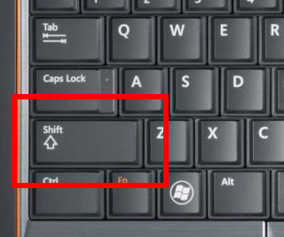
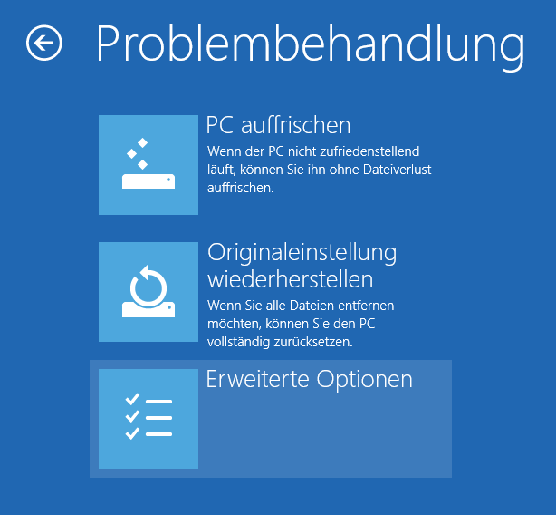
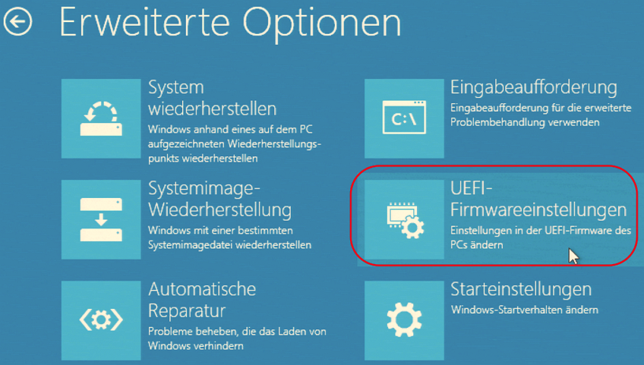
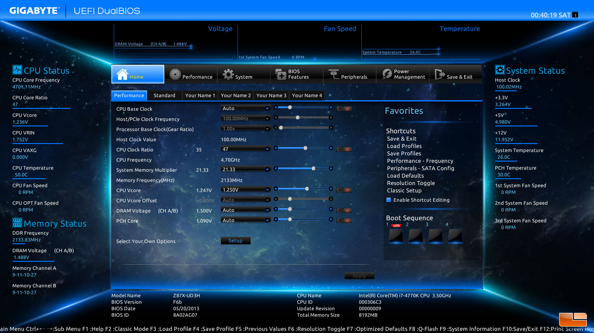
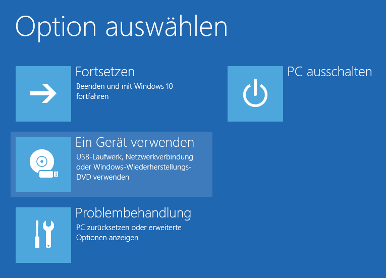

# Starten via UEFI

UEFI ist die Firmware neuerer Computer. Obwohl es auch bei den meisten neueren Computern möglich ist, direkt nach dem Neustarten mit einer Tastenkombination die Firmware-Einstellungen aufzurufen, wird diese nur noch bei wenigen Modellen überhaupt angezeigt.
Falls auf Ihrem Computer Windows 8 oder eine neuere Version installiert ist, funktioniert der Zugang zur Firmware folgendermaßen:

1. Halten Sie die Shift-Taste gedrückt:

2. Starten Sie den Computer neu (und lassen dabei die Shift-Taste weiterhin gedrückt!):

3. Windows zeigt daraufhin einige Optionen an. Wählen Sie den Menüpunkt “Problembehandlung”:

4. In der nächsten Ansicht wählen Sie den Menüpunkt “Erweiterte Optionen”:

5. In der nächsten Ansicht wählen Sie den Menüpunkt “UEFI-Firmwareeinstellungen”:

Nach Auswahl des Menüpunktes startet der Computer neu und sie gelangen in die UEFI-Firmwareeinstellungen. 

Wie schon beim BIOS hat auch bei UEFI jeder Hersteller seine ganz eigene Firmware-Variante. 
Meistens sind es grafische Oberflächen, die auch einfach mit der Maus bedienbar sind, hier ein Beispiel:

Schauen Sie in das Handbuch des Computers oder suchen Sie in der UEFI-Firmware die Einstellungen zur Umstellung der Bootreihenfolge. 
Ändern Sie die Reihenfolge so, dass USB an erster Stelle steht.

Bei manchen Computern muss in der Firmware noch eine Option “Fast Boot” deaktiviert werden. Wenn diese Option aktiviert ist, wird die eingestellte Bootreihenfolge nämlich ignoriert und immer sofort von Festplatte gestartet.

Manche Computer können im UEFI-Modus nicht fehlerfrei von USB gestartet werden. Dort kann es helfen, den Bootmodus von “UEFI” auf wieder auf “BIOS” zu stellen. Bei einigen Firmware-Varianten wird der BIOS-Modus auch mit “Legacy” oder “CSM” bezeichnet.

Falls Sie nicht schaffen, die Bootreihenfolge im UEFI dauerhaft umzustellen, können Sie auch aus Windows heraus temporär von einem anderen Medium booten. Starten Sie den Computer wieder bei gedrückter Shift-Taste neu und wählen Sie die Option “Ein Gerät verwenden”:

Wählen Sie dann aus der angebotenen Liste den Lernstick oder die Lernstick-DVD.