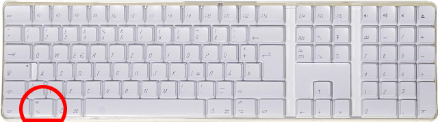
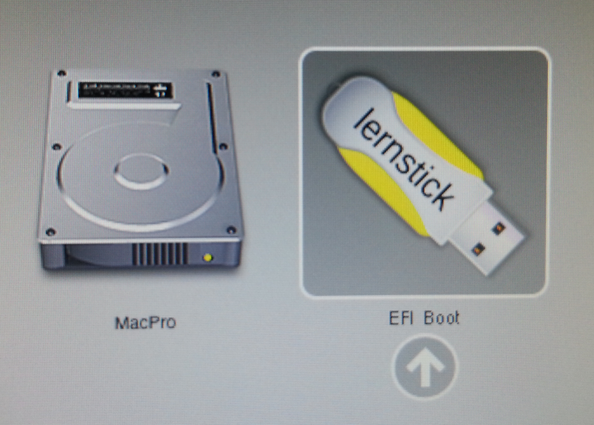

# Systemstart am Mac

Hinweis: Dies funktioniert nur mit Intel-Macs. Ältere Geräte, die noch auf der PowerPC-Architektur basieren, werden nicht unterstützt! Um einen Mac vom Lernstick starten zu können, bedarf es nur weniger Schritte:

1. Starten Sie Ihren Mac und halten sie während des Startvorganges die [alt]-Taste gedrückt.

2. Nach wenigen Sekunden sollte Ihr Mac neben der eigenen Festplatte ein weiteres Symbol mit der Bezeichnug “Lernstick” anzeigen:

Klicken Sie auf den Pfeil unter dem Lernstick-Symbol, um den Lernstick zu starten.

3. Für den Fall, dass ihr Mac nicht fehlerfrei vom Lernstick gestartet werden kann, versuchen Sie es zusätzlich mit der Lernstick-DVD. 
4. Dann sollte Ihr Mac neben der eigenen Festplatte und dem Lernstick ein weiteres Symbol mit der Bezeichnung “Windows” anzeigen. Lassen Sie sich bitte nicht davon verwirren, dass die Lernstick-DVD am Mac als “Windows” bezeichnet wird. 
5. Dies ist kein Fehler unsererseits, sondern spiegelt das doch recht einfache Marktverständnis der Firma Apple wieder. Nach dem Motto: “Wenn es nicht von uns ist, muss es ja Windows sein…”

Hinweis:
Unter Umständen wird das Lernstick-Symbol am Mac zweimal angezeigt. Das ist immer dann der Fall, wenn Sie einen USB-Stick verwenden, der sich selbst als "entfernbares" Speichermedium ausgibt und darauf eine Austauschpartition angelegt haben, die mit FAT32 formatiert ist. In diesem Fall legt die Speichermedienverwaltung die Boot-Dateien sowohl auf der eigentlichen Boot-Partition als auch auf der Austauschpartition an. Die Begründung dafür ist, dass auf entfernbaren USB-Sticks anstatt der Bootpartition die Austauschpartition die erste Partition sein muss, weil Windows die Partition sonst nicht sieht und einige Notebooks nur von der ersten FAT32-Partition booten.
Der Mac erkennt dann allerdings sowohl die Austauschpartition als auch die Bootpartition als bootfähige Partitionen. Sie können einfach irgendeines der beiden Lernstick-Icons anklicken, damit der Lernstick gestartet wird.

Bei neueren MacBooks, in denen der T2-Chip verbaut ist, muss erst das so genannte "Startsicherheitsdienstprogramm" gestartet werden, siehe:[https://support.apple.com/de-de/HT208198](https://support.apple.com/de-de/HT208198)

Dort müssen dann zwei Dinge erlaubt werden:

* dass etwas anderes als macOS gestartet werden darf (von Apple etwas manipulativ unter dem Menüpunkt "Sicheres Starten -> Ohne Sicherheit" untergebracht)
* dass von externen Medien gestartet werden darf (Menüpunkt "Externes Starten -> Starten von externen Medien erlauben")

Dann sollte zumindest der Bootvorgang auf diesen MacBooks gestartet werden können.