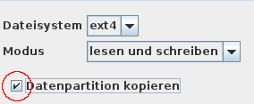
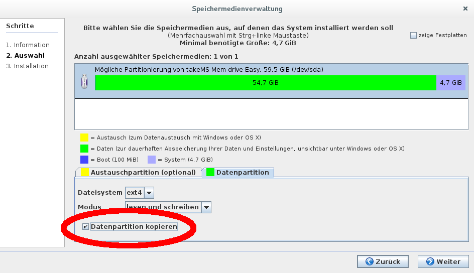

# Vervielfältigung - MASTER-Stick

Wenn eine größere Anzahl Lernsticks (z.B. für eine ganze Klasse oder Schule) erstellt werden soll, so ist es sinnvoll, zunächst einen so genannten MASTER-Stick zu erstellen, auf dem alle notwendigen Anpassungen (Einrichtung von Drucker und WLAN, Installation von zusätzlich benötigter Software, Deinstallation ungewünschter Software, Hinzufügen von eigenen Dateien, Anpassung der Konfiguration, z.B. Lesezeichen im Browser, etc.) vorgenommen werden. 
Erst, wenn dieser MASTER-Stick vollständig angepasst wurde, sollten die weiteren Lernsticks als Kopie des MASTER-Sticks erstellt werden. Dazu geht man folgendermaßen vor:

1. Der MASTER-Stick muss im Modus “Nur Lesen” oder “nicht verwenden” gestartet werden, damit die Datenpartition nicht in Benutzung ist und in einem konsistenten Zustand kopiert werden kann.

Wenn die Datenpartition nicht in Benutzung ist, werden alle nachträglich installierten Aktualisierungen nicht verwendet, also auch nicht die aktuellste Version des Installationsprogramms.

Wenn die Lernstick-Version des MASTER-Sticks schon etwas älter ist, lohnt es sich, vor dem Start des Installationsprogramms im “Lesen- und Schreiben”-Modus nochmals “synaptic” zu starten und zu überprüfen, ob eine aktuellere Version des Pakets "dlcopy" installiert werden kann. Oder im Terminal folgenden Befehl eingeben:

```bash
sudo apt-get install --reinstall dlcopy dlcopy-common
```

2. Starten Sie die Speichermedienverwaltung. Im Schritt "Auswahl" muss die Option "Datenpartition kopieren" ausgewählt werden (siehe rot umrandeter Bereich im Bild rechts und unten).



3. Falls Sie auf den Lernsticks auch eine Austauschpartition verwenden wollen und auch dort zusätzliche eigene Dateien gespeichert haben, die ebenfalls vervielfältigt werden sollen, so wählen Sie auch die Option "Austauschpartition kopieren".



4. Führen Sie die Installation dann wie im Abschnitt “Bespielen von USB-Sticks” beschrieben fort.